# UD1 · Diseño de Interfaces, Comunicación Visual y Figma Base :material-palette-swatch:

## 1. Introducción :material-compass-rose:

Antes de escribir una sola línea de HTML, un desarrollador de interfaces necesita entender **cómo se comunica visualmente la información**. Esta unidad sienta las bases teóricas (percepción visual, color, tipografía) y la primera herramienta práctica del módulo: **Figma**.

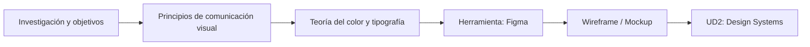


---

## 2. Comunicación visual: fundamentos :material-eye-outline:

### 2.1 Percepción visual y Leyes de la Gestalt

La Gestalt es una corriente de la psicología (Alemania, principios del s. XX) que estudia cómo el ojo humano **agrupa elementos visuales de forma automática**, antes incluso de procesar el significado. Son la base de por qué un layout "se lee bien" o "se ve caótico".

| Principio | Descripción | Aplicación en interfaces web |
| --- | --- | --- |
| **Proximidad** | Elementos cercanos se perciben como un grupo. | Espaciado (`gap`, `margin`) entre elementos relacionados vs. no relacionados. |
| **Similitud** | Elementos con el mismo color, forma o tamaño se agrupan mentalmente. | Botones del mismo tipo comparten estilo; los de distinto tipo se diferencian claramente. |
| **Cierre** | El cerebro completa formas incompletas. | Iconografía minimalista (p. ej. un logo que sugiere una forma sin dibujarla entera). |
| **Continuidad** | El ojo sigue líneas y curvas de forma natural. | Alineación de elementos en grid; el usuario "escanea" la página en patrones predecibles. |
| **Figura-fondo** | Distinguimos un elemento (figura) de su entorno (fondo). | Contraste suficiente entre contenido interactivo y fondo — enlaza con accesibilidad (**RA5**). |
| **Simetría y orden** | Preferimos composiciones equilibradas y predecibles. | Grids simétricos, alineación consistente de columnas. |

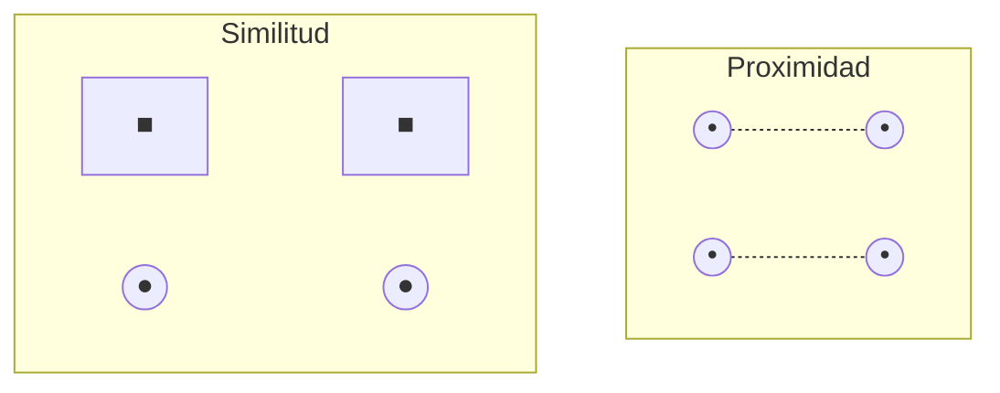

---

### 2.2 Patrones de lectura (eye-tracking)

Los estudios de seguimiento ocular han identificado dos patrones dominantes de escaneo en pantalla:

* :material-format-align-left: **Patrón en F**: Típico de páginas con mucho texto (blogs, artículos). El usuario lee la primera línea completa, luego escanea verticalmente el margen izquierdo.
* :material-format-text-wrapping-overflow: **Patrón en Z**: Típico de *landing pages* con poco contenido. El ojo recorre de arriba-izquierda a arriba-derecha, en diagonal hacia abajo-izquierda, y termina en abajo-derecha (donde suele ir el CTA principal).

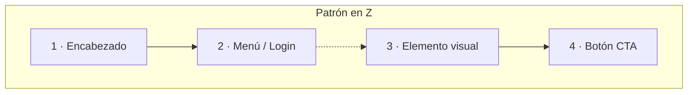

!!! info "Elección de presentación"
    Elegir entre disponer la información en columnas, tarjetas, listas o tablas (**RA1.c**) no es una decisión estética: depende de qué patrón de lectura vas a inducir. Retomaremos esto en UD2 al hablar de *layout* y *design tokens*.

---

### 2.3 Los cuatro principios C.R.A.P.

Un marco práctico y muy citado en diseño de interfaces (Robin Williams, *The Non-Designer's Design Book*) resume la comunicación visual en cuatro principios memorizables:

=== ":material-contrast: Contraste"
    **Los elementos distintos deben verse claramente distintos.**

    * **Ejemplo correcto:** Un botón primario relleno con color de acento vs. un botón secundario transparente con borde.
    * **Fallo típico:** Un botón secundario casi idéntico al primario.

=== ":material-repeat: Repetición"
    **Elementos visuales que se repiten dan coherencia y cohesión.**
    
    * **Ejemplo correcto:** Mantener el mismo radio de curvatura (`border-radius: 8px`) e interlineado en todas las tarjetas de la app.
    * **Fallo típico:** Cada página usa un radio de borde distinto en las tarjetas.

=== ":material-format-align-center: Alineación"
    **Nada debería colocarse de forma arbitraria. Cada elemento debe tener una conexión visual con otro.**
    
    * **Ejemplo correcto:** Alinear los textos a la izquierda siguiendo una línea guía vertical invisible.
    * **Fallo típico:** Textos centrados que rompen la alineación del resto del layout.

=== ":material-select-group: Proximidad"
    **Agrupar los elementos relacionados y separar los que no lo estén.**
    
    * **Ejemplo correcto:** Un grupo de campos de formulario separados claramente del siguiente bloque mediante un espacio mayor.
    * **Fallo típico:** Un label de formulario más cerca del campo anterior que del suyo propio.

---

## 3. Teoría del color aplicada a pantallas :material-palette:

### 3.1 Modelos de color en la Web

| Modelo | Muestra | Sintaxis CSS | Uso típico |
| --- | :---: | --- | --- |
| **HEX** | <span style="color:#1E88E5; font-size: 1.5em;">██</span> | `#1E88E5` | El más usado en diseño; fácil de copiar entre Figma y CSS. |
| **RGB / RGBA** | <span style="color:rgba(30, 136, 229, 0.8); font-size: 1.5em;">██</span> | `rgb(30 136 229 / 80%)` | Cuando necesitas transparencia explícita mediante canal alfa. |
| **HSL / HSLA** | <span style="color:hsl(207, 71%, 51%); font-size: 1.5em;">██</span> | `hsl(207 71% 51%)` | El más intuitivo para ajustar un color sin recalcular el valor HEX. |
| **OKLCH** *(moderno)* | <span style="color:oklch(62% 0.19 253); font-size: 1.5em;">██</span> | `oklch(62% 0.19 253)` | Modelo perceptualmente uniforme; ideal para escalas de color coherentes. |

!!! tip "Consejo para HSL"
    Si tienes un color base en HSL, generar variantes más claras u oscuras es tan simple como modificar únicamente el tercer valor (Luminosidad / *Lightness*).

---

### 3.2 Psicología y convención del color

| Color | Muestra | Asociación habitual | Uso frecuente en UI |
| --- | :---: | --- | --- |
| **Azul / Teal** | <span style="color:#0D9488; font-size: 1.4em;">██</span> | Confianza, calma, profesionalidad | Enlaces, banca, SaaS corporativo |
| **Verde** | <span style="color:#16A34A; font-size: 1.4em;">██</span> | Éxito, confirmación, naturaleza | Estados "completado", fintech, salud |
| **Rojo** | <span style="color:#DC2626; font-size: 1.4em;">██</span> | Alerta, error, urgencia | Mensajes de error, acciones destructivas |
| **Amarillo / Naranja** | <span style="color:#D97706; font-size: 1.4em;">██</span> | Atención, advertencia | Estados de aviso (*warning*), CTAs promocionales |
| **Gris / Negro** | <span style="color:#475569; font-size: 1.4em;">██</span> | Neutralidad, elegancia | Texto de cuerpo, fondos, interfaces minimalistas |

!!! warning "Accesibilidad cromática (WCAG)"
    El color nunca debe ser el **único** portador de significado. Un campo de formulario marcado únicamente en rojo por error, sin un icono o mensaje explicativo adjunto, es invisible para una persona con daltonismo (~8% de los hombres). Esta regla es clave en **RA5 (Accesibilidad)**.

---

### 3.3 Contraste y legibilidad

La fórmula de contraste de la W3C (WCAG 2.2) compara la luminancia relativa de dos colores:

$$\text{Ratio de contraste} = \frac{L_1 + 0.05}{L_2 + 0.05}$$

donde $L_1$ es la luminancia relativa del color más claro y $L_2$ la del más oscuro.

| Nivel WCAG | Ratio mínimo (Texto normal) | Ratio mínimo (Texto grande ≥18pt) |
| --- | --- | --- |
| **AA** | **4.5:1** | **3:1** |
| **AAA** | **7:1** | **4.5:1** |

!!! example "Herramientas de verificación"
    No hace falta calcular esta fórmula a mano: en Figma utilizaremos plugins automáticos como **Stark** o **Contrast** para verificar la accesibilidad en tiempo real mientras diseñamos.

---

## 4. Tipografía para pantallas :material-format-font:

### 4.1 Clasificación tipográfica

| Familia | Características | Ejemplo | Uso recomendado |
| --- | --- | --- | --- |
| **Serif** | Remates ornamentales en los trazos | Georgia, Merriweather | Textos largos impresos o editoriales; transmite tradición. |
| **Sans-serif** | Sin remates, trazos limpios y directos | Inter, Roboto, Helvetica | **Interfaces Web (UI)** — óptima legibilidad en pantallas. |
| **Monospace** | Ancho de carácter fijo | JetBrains Mono, Fira Code | Bloques de código, datos tabulares y terminales. |
| **Display** | Decorativa, muy estilizada | Pacifico, Bebas Neue | Titulares de gran tamaño; nunca para párrafos. |

---

### 4.2 Legibilidad: reglas prácticas

```markdown
* Tamaño base recomendado:  ≥ 16px (1rem)
* Interlineado ideal:        1.4 a 1.6 × tamaño de la fuente (line-height: 1.5)
* Longitud de línea óptima: 45 a 75 caracteres por línea
* Límite de familias:       Máximo 1 o 2 por proyecto

```

---

### 4.3 Origen de las fuentes

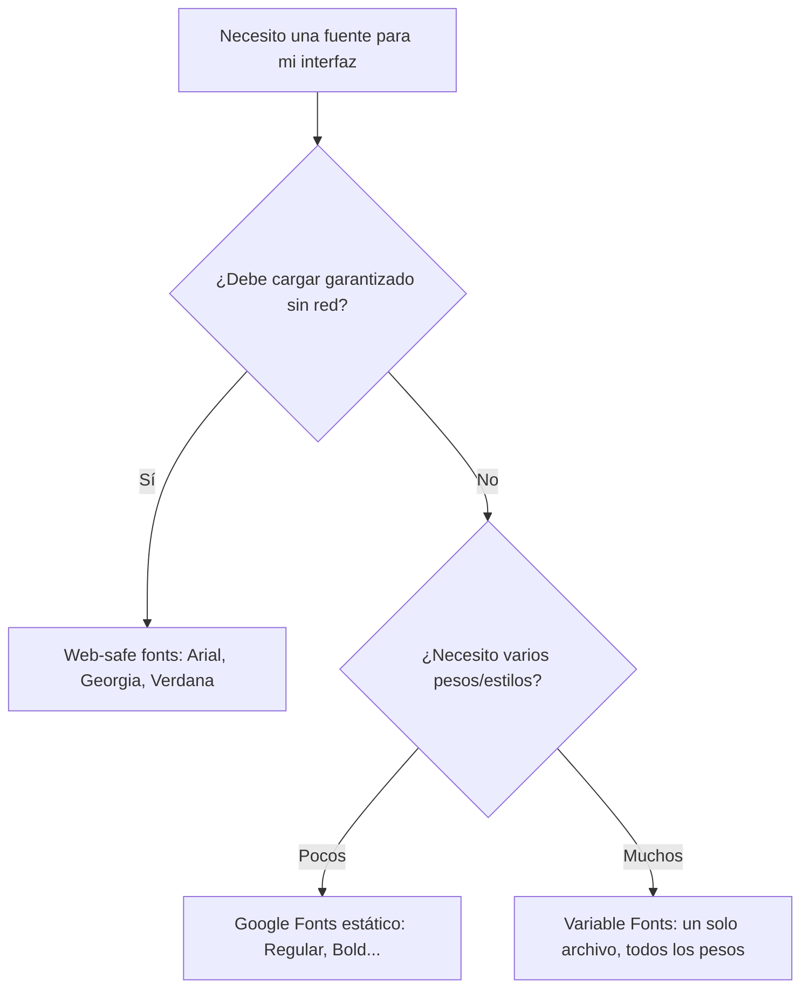

!!! note "Optimización con Variable Fonts"
    Una *variable font* contiene todos los pesos (100-900) e inclinaciones en **un único archivo**, interpolables mediante CSS (`font-variation-settings`). Reduce peticiones HTTP frente a cargar 4-5 archivos estáticos.

---

### 4.4 Jerarquía tipográfica (Escala modular 1.25)

| Nivel | Tamaño (rem) | Equivalencia (px) | Uso recomendado |
| --- | --- | --- | --- |
| **Display** | `3.052rem` | ~48.8px | Hero / Titular de impacto |
| **H1** | `2.441rem` | ~39.0px | Título principal de página |
| **H2** | `1.953rem` | ~31.2px | Secciones principales |
| **H3** | `1.563rem` | ~25.0px | Subsecciones |
| **H4** | `1.25rem` | ~20.0px | Tarjetas y bloques menores |
| **Body** | `1rem` | 16.0px | Texto de párrafo base |
| **Small** | `0.8rem` | ~12.8px | Pie de foto, metadatos, badges |

---

## 5. Introducción a Figma :fontawesome-brands-figma:

### 5.1 ¿Por qué Figma como herramienta de referencia?

Figma es el estándar de facto en diseño de interfaces colaborativo: funciona directamente en el navegador, permite colaboración en tiempo real y es la base sobre la que construiremos **Design Systems y Design Tokens en la UD2**. Cumple el criterio **RA1.e**.

---

### 5.2 Instalación, cuenta educativa y cliente local

Figma ofrece acceso gratuito a su plan profesional para estudiantes y docentes.

[Obtener Licencia Educativa en Figma :material-open-in-new:](https://www.google.com/search?q=https://www.figma.com/education/){ .md-button .md-button--primary }

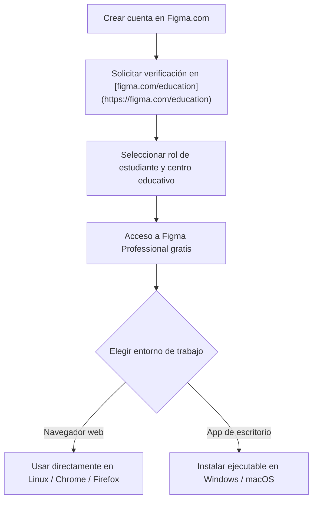

=== ":material-laptop: Navegador Web"
* **Sistemas soportados:** Linux, macOS, Windows, ChromeOS.
* **Ventajas:** Sin necesidad de instalación, actualización automática.
* **Requisito:** Instalar el complemento *Figma Font Installer* si quieres usar las fuentes tipográficas locales de tu ordenador.

=== ":material-desktop-tower: App de Escritorio"
* **Sistemas soportados:** Windows, macOS.
* **Ventajas:** Mayor rendimiento con proyectos complejos, uso automático de fuentes locales instaladas, pestañas independientes de trabajo.

---

### 5.3 Anatomía del espacio de trabajo

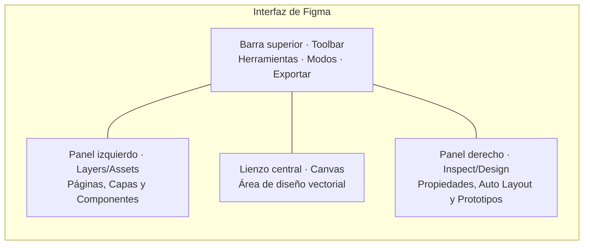

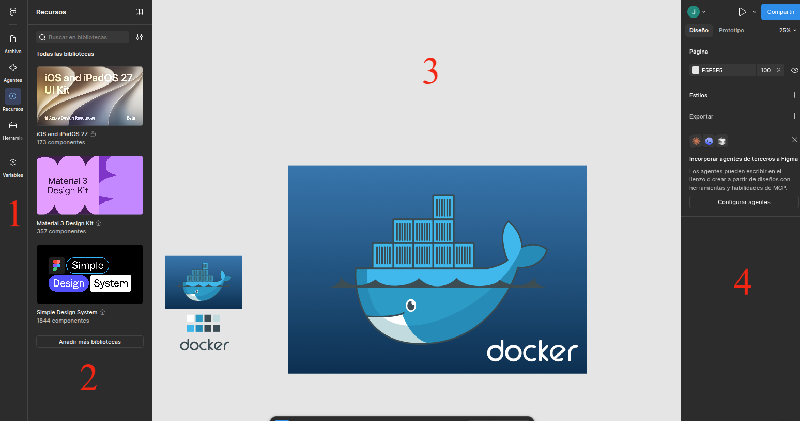


| Zona | Nombre | Función principal |
| --- | --- | --- |
| :material-numeric-1-circle: | **Barra Superior** (*Toolbar*) | Herramientas vectoriales, creación de Marcos (F), texto (T), comentarios y botón *Present/Play*. |
| :material-numeric-2-circle: | **Panel Izquierdo** (*Layers/Assets*) | Árbol de capas organizadas por páginas, Marcos y biblioteca de componentes reutilizables. |
| :material-numeric-3-circle: | **Lienzo Central** (*Canvas*) | Espacio de trabajo vectorial infinito donde se crean las pantallas. |
| :material-numeric-4-circle: | **Panel Derecho** (*Design/Inspect*) | Configuración de color, tipografía, **Auto Layout**, alineaciones y enlaces interactivos de prototipado. |

---

### 5.4 Flujo de trabajo práctico en Figma

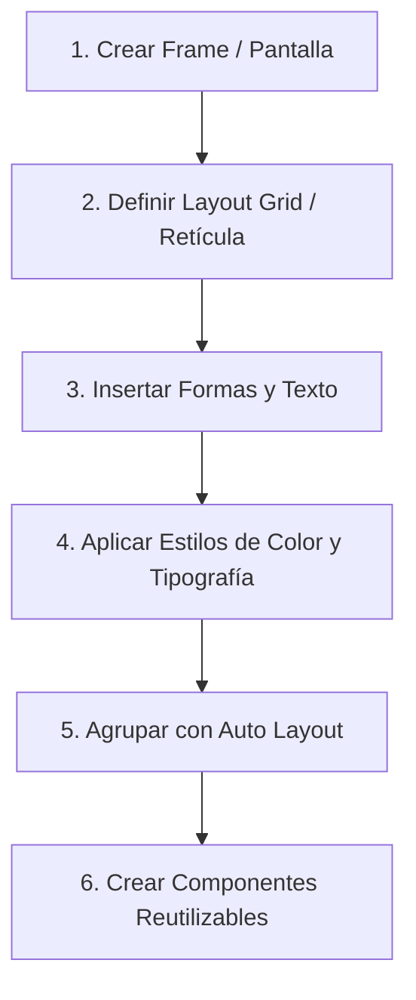

!!! success "Paralelismo Figma ↔ CSS Flexbox"
El sistema **Auto Layout** de Figma (Shift + A) equivale directamente al comportamiento de **CSS Flexbox**:


```css
.card-container {
  display: flex;
  flex-direction: column;
  padding: 24px;
  gap: 16px;
}
```


---

### 5.5 Colaboración y revisiones

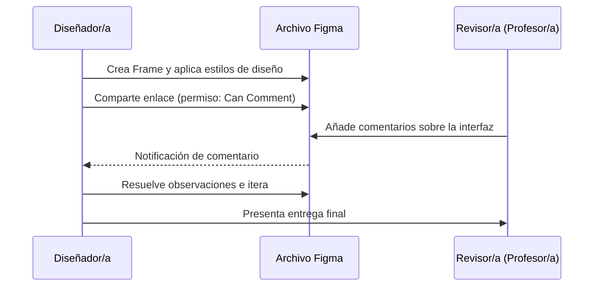

---

## 6. Alternativas de presentación de la información :material-view-dashboard:

No toda la información se presenta igual. Antes de maquetar, hay que elegir el formato adecuado:

| Formato | Cuándo usarlo | Ejemplo práctico |
| --- | --- | --- |
| **Lista** | Secuencia de ítems sin jerarquía compleja | Menús de navegación, pasos de un proceso |
| **Tabla** | Datos estructurados comparables en filas y columnas | Tabla de precios, comparativa de planes |
| **Tarjetas** (*Cards*) | Ítems con múltiples atributos e imagen | Catálogo de productos, entradas de blog |
| **Pestañas** (*Tabs*) | Contenido alternativo que comparte el mismo espacio | Ficha de producto (Descripción / Specs) |
| **Acordeón** | Contenido extenso colapsable | Sección de preguntas frecuentes (FAQ) |

---

### 6.1 Niveles de fidelidad en diseño

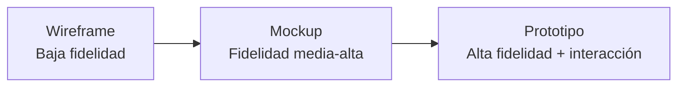

| Nivel | Enfoque principal | Herramientas habituales |
| --- | --- | --- |
| **Wireframe** | Estructura, distribución y jerarquía (sin color final ni imágenes). | Papel y lápiz, Figma en escala de grises. |
| **Mockup** | Aspecto visual final (colores definitivos, tipografía real, imágenes). | Figma. |
| **Prototipo** | Mockup visual + comportamiento interactivo (clics, animaciones, rutas). | Figma (*Prototype Mode*). |

---

## 7. Actividad práctica de la unidad :material-clipboard-check:

!!! example "Práctica UD1: Diseño de una Ficha de Producto"
    **Objetivo:** Aplicar los principios de comunicación visual, paleta de colores accesible y jerarquía tipográfica en una pantalla real utilizando Figma.


**Pasos a realizar:**

1. **Creación del Canvas:** Diseña un Frame de escritorio de `1440 × 1024 px` en Figma.
2. **Layout Grid:** Configura una retícula de 12 columnas con margen de `80px` y medianil (*gutter*) de `24px`.
3. **Aplicación de C.R.A.P. & Gestalt:**
    * Muestra al menos 3 principios de la Gestalt en la ficha (ej. Proximidad en precio/botón, Similitud en badges).
4. **Paleta de Color y Tipografía:**
    * Define 5 colores (1 primario, 1 secundario, 3 neutros) guardados como *Styles*.
    * Configura una escala tipográfica clara con un mínimo de 4 niveles.
5. **Verificación de Accesibilidad:**
    * Comprueba con el plugin **Stark** que todos los textos cumplen el nivel **WCAG AA** (ratio ≥ 4.5:1).
6. **Entrega:** Comparte el enlace público de Figma con permisos de lectura/comentario.


---

## 8. Resumen y conexión con la siguiente unidad :material-link-variant:

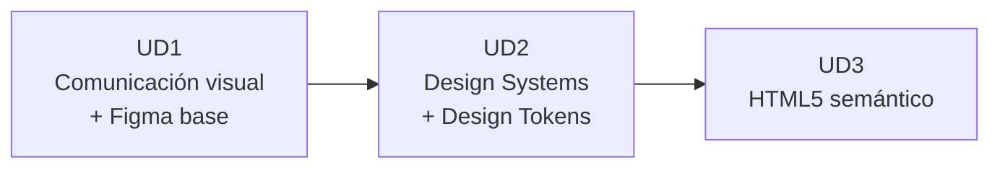

* Los principios de **comunicación visual** (Gestalt, C.R.A.P.) justifican técnicamente cada decisión de diseño.
* El **color** y la **tipografía** requieren cumplir métricas objetivas de accesibilidad (WCAG 2.2).
* **Figma** proporciona los cimientos (Frames, Auto Layout, Styles) que transformaremos en **Design Systems y Design Tokens** durante la **UD2**.

---

## 9. Referencias y fuentes :material-book-open-page-variant:

* Williams, R. — *The Non-Designer's Design Book* (Principios C.R.A.P.).
* W3C — [Web Content Accessibility Guidelines (WCAG) 2.2](https://www.google.com/search?q=https://www.w3.org/TR/WCAG22/).
* Documentación oficial — [Figma Help Center](https://www.google.com/search?q=https://help.figma.com/).
