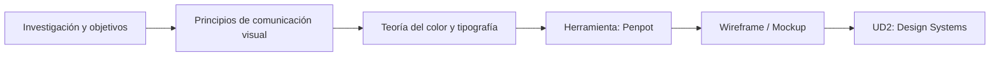
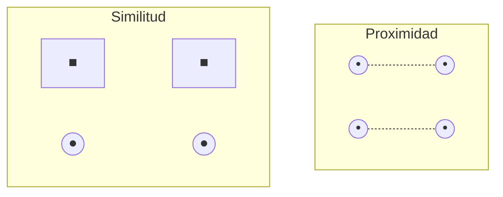
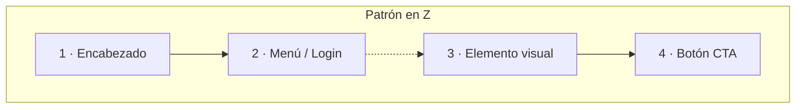
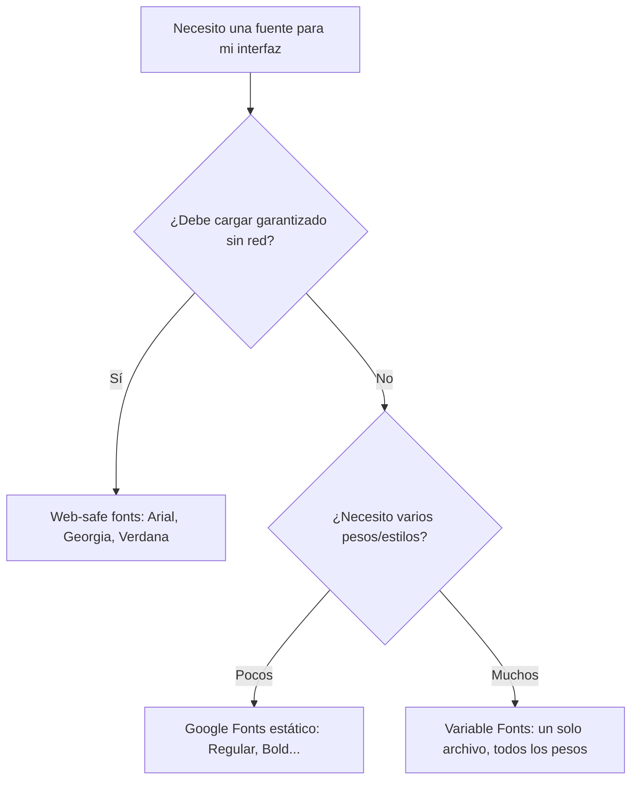
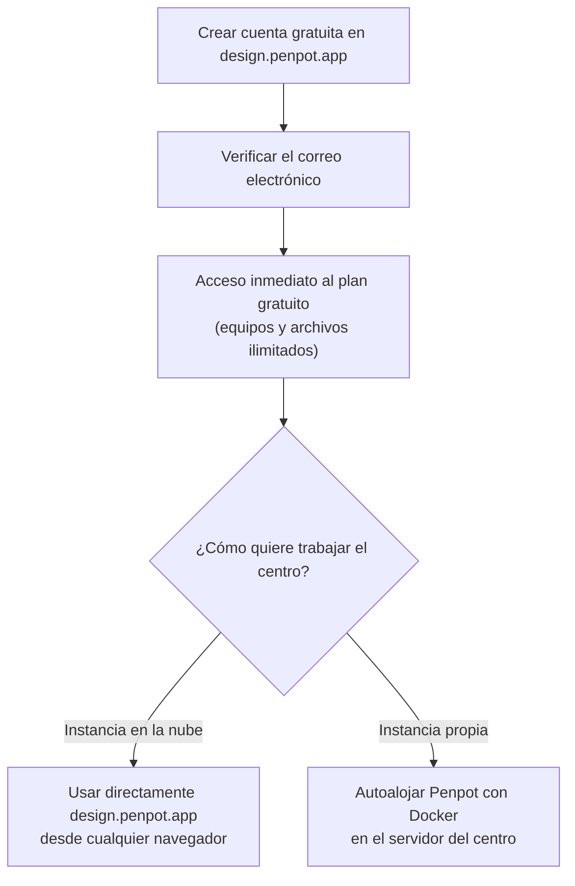
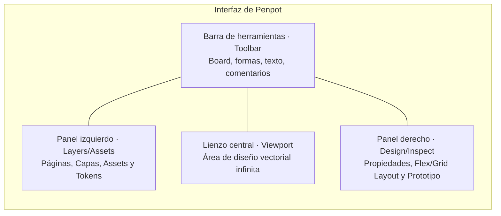
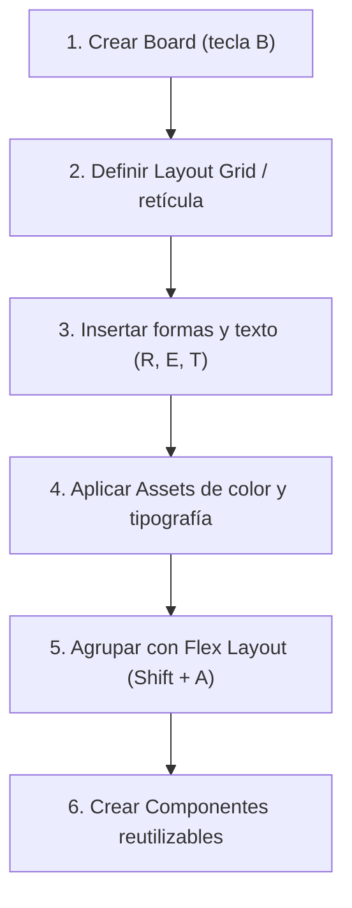
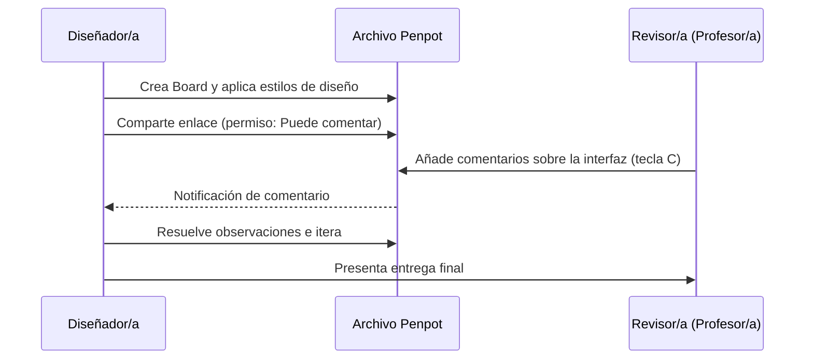
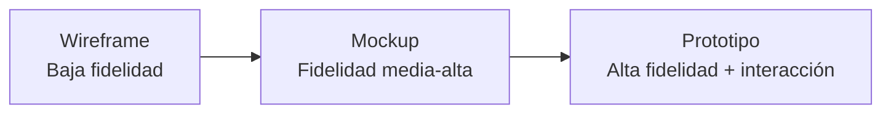

# UD1 · Diseño de Interfaces, Comunicación Visual y Penpot Base :material-palette-swatch:

## 1. Introducción :material-compass-rose:

Antes de escribir una sola línea de HTML, un desarrollador de interfaces necesita entender **cómo se comunica visualmente la información**. Esta unidad sienta las bases teóricas (percepción visual, color, tipografía) y la primera herramienta práctica del módulo: **Penpot**.

!!! info "El hilo conductor de esta unidad"
    A lo largo de todo el temario vamos a construir, paso a paso, la ficha de producto de una marca ficticia llamada **AURIA** (auriculares inalámbricos). Cada concepto nuevo que aprendas se aplica directamente sobre ese mismo diseño — así que si en algún momento te pierdes en la teoría, vuelve al ejemplo de AURIA y pregúntate "¿cómo se vería esto en mi ficha de producto?".

Antes de entrar en materia, conviene tener clara la diferencia entre dos preguntas que se confunden con facilidad:

* **¿Qué aspecto tiene?** → Es una pregunta de estilo: colores, formas, tamaños.
* **¿Cómo se entiende?** → Es una pregunta de comunicación: qué percibe el cerebro antes de razonar nada.

Esta unidad trata sobre la segunda pregunta. El "aspecto" (CSS) llega en la UD4; aquí construimos los cimientos que hacen que ese aspecto, cuando lo apliques, funcione.



---

## 2. Comunicación visual: fundamentos :material-eye-outline:

### 2.1 Percepción visual y Leyes de la Gestalt

Imagina que ves, durante medio segundo, una fila de seis puntos en pantalla: tres muy juntos a la izquierda y tres muy juntos a la derecha, con un hueco grande en medio. Sin pensarlo, tu cerebro no ve "seis puntos sueltos" — ve **dos grupos de tres**. Nadie te lo ha explicado, no lo has razonado: tu percepción lo ha decidido por ti, antes de que la parte consciente del cerebro entrara en acción.

Eso es la Gestalt: una corriente de la psicología (Alemania, principios del s. XX) que estudia cómo el ojo humano **agrupa elementos visuales de forma automática**, antes incluso de procesar el significado. Es la base de por qué un layout "se lee bien" o "se ve caótico" — y es la razón por la que, cuando algo en una interfaz "no sé qué tiene pero no me gusta", casi siempre hay un principio de Gestalt roto detrás.

| Principio | Descripción | Aplicación en interfaces web |
| --- | --- | --- |
| **Proximidad** | Elementos cercanos se perciben como un grupo. | Espaciado (`gap`, `margin`) entre elementos relacionados vs. no relacionados. |
| **Similitud** | Elementos con el mismo color, forma o tamaño se agrupan mentalmente. | Botones del mismo tipo comparten estilo; los de distinto tipo se diferencian claramente. |
| **Cierre** | El cerebro completa formas incompletas. | Iconografía minimalista (p. ej. un logo que sugiere una forma sin dibujarla entera). |
| **Continuidad** | El ojo sigue líneas y curvas de forma natural. | Alineación de elementos en grid; el usuario "escanea" la página en patrones predecibles. |
| **Figura-fondo** | Distinguimos un elemento (figura) de su entorno (fondo). | Contraste suficiente entre contenido interactivo y fondo — enlaza con accesibilidad (**RA5**). |
| **Simetría y orden** | Preferimos composiciones equilibradas y predecibles. | Grids simétricos, alineación consistente de columnas. |



!!! example "Aplicado a AURIA"
    En la ficha de producto de AURIA, el precio (`249 €`) y el botón "Comprar" están pegados el uno al otro, con más espacio hacia el resto del contenido. Eso es **Proximidad**: el cerebro los interpreta como "una sola unidad de acción" (ver precio → comprar), aunque técnicamente sean dos elementos independientes.

??? question "Autoevaluación — antes de seguir"
    Si en tu ficha de producto pones el nombre del auricular, su precio y su valoración en estrellas todos con el mismo tamaño de letra y el mismo peso, sin distinguir uno de otro por tamaño ni color... ¿qué principio de Gestalt estás dejando de aprovechar, y qué consecuencia tiene para quien lee la pantalla por primera vez?

    **Respuesta:** Estarías desaprovechando la **Similitud** (y de paso la jerarquía visual, que veremos en el Bloque 4 de la práctica): si todo se ve "igual de importante", el usuario no sabe por dónde empezar a leer. La vista necesita diferencias de tamaño/peso/color para saber qué mirar primero.

---

### 2.2 Patrones de lectura (eye-tracking)

Antes de maquetar nada, hace falta responder una pregunta muy concreta: **¿por dónde va a entrar el ojo del usuario en esta pantalla, y por dónde va a salir?** Los estudios de seguimiento ocular (eye-tracking) han identificado dos patrones dominantes de escaneo en pantalla, y elegir el que no toca es un error de diseño tan grave como elegir mal el color:

* :material-format-align-left: **Patrón en F**: Típico de páginas con mucho texto (blogs, artículos). El usuario lee la primera línea completa, luego escanea verticalmente el margen izquierdo, sin llegar a leer el resto de cada línea con la misma atención.
* :material-format-text-wrapping-overflow: **Patrón en Z**: Típico de *landing pages* con poco contenido. El ojo recorre de arriba-izquierda a arriba-derecha, en diagonal hacia abajo-izquierda, y termina en abajo-derecha (donde suele ir el CTA principal).



!!! info "Elección de presentación"
    Elegir entre disponer la información en columnas, tarjetas, listas o tablas (**RA1.c**) no es una decisión estética: depende de qué patrón de lectura vas a inducir. Retomaremos esto en UD2 al hablar de *layout* y *design tokens*.

!!! example "Aplicado a AURIA"
    Una ficha de producto tiene poco texto y un objetivo de conversión muy claro (comprar), así que sigue el **patrón en Z**: logo arriba-izquierda → precio/CTA arriba-derecha → imagen del producto en el centro → botón de compra definitivo abajo-derecha, justo donde termina el recorrido natural del ojo.

??? question "Autoevaluación"
    Si estuvieras maquetando la página de un blog de noticias tecnológicas con artículos largos, ¿qué patrón elegirías y por qué cambiaría la posición del titular respecto a la ficha de AURIA?

    **Respuesta:** Patrón en **F**, porque hay mucho texto que leer en profundidad. El titular seguiría arriba, pero el contenido importante se concentraría en el **margen izquierdo** (que es donde el ojo vuelve una y otra vez), no repartido en diagonal como en la ficha de producto.

---

### 2.3 Los cuatro principios C.R.A.P.

La Gestalt explica *cómo percibimos*; C.R.A.P. es un marco mucho más práctico y accionable — casi una checklist — para revisar si un diseño concreto "funciona" o no. Son cuatro preguntas que puedes hacerte sobre cualquier pantalla, en este orden:

Un marco práctico y muy citado en diseño de interfaces (Robin Williams, *The Non-Designer's Design Book*) resume la comunicación visual en cuatro principios memorizables:

=== ":material-contrast: Contraste"
    **Los elementos distintos deben verse claramente distintos.**

    * **Ejemplo correcto:** Un botón primario relleno con color de acento vs. un botón secundario transparente con borde.
    * **Fallo típico:** Un botón secundario casi idéntico al primario.

=== ":material-repeat: Repetición"
    **Elementos visuales que se repiten dan coherencia y cohesión.**
    
    * **Ejemplo correcto:** Mantener el mismo radio de curvatura (`border-radius: 8px`) e interlineado en todas las tarjetas de la app.
    * **Fallo típico:** Cada página usa un radio de borde distinto en las tarjetas.

=== ":material-format-align-center: Alineación"
    **Nada debería colocarse de forma arbitraria. Cada elemento debe tener una conexión visual con otro.**
    
    * **Ejemplo correcto:** Alinear los textos a la izquierda siguiendo una línea guía vertical invisible.
    * **Fallo típico:** Textos centrados que rompen la alineación del resto del layout.

=== ":material-select-group: Proximidad"
    **Agrupar los elementos relacionados y separar los que no lo estén.**
    
    * **Ejemplo correcto:** Un grupo de campos de formulario separados claramente del siguiente bloque mediante un espacio mayor.
    * **Fallo típico:** Un label de formulario más cerca del campo anterior que del suyo propio.

!!! tip "Truco para no olvidarlo en clase"
    C.R.A.P. y la Gestalt se solapan a propósito — la **Proximidad** aparece en los dos marcos porque es, con diferencia, el principio que más se rompe en diseños de gente que empieza. Si solo puedes revisar una cosa antes de entregar tu práctica, revisa la proximidad.

??? question "Autoevaluación"
    Tienes dos botones en tu ficha AURIA: "Añadir al carrito" (acción principal) y "Ver ficha técnica" (acción secundaria), y los has diseñado exactamente del mismo tamaño, mismo color relleno, uno al lado del otro. ¿Qué principio C.R.A.P. estás incumpliendo?

    **Respuesta:** **Contraste.** Si las dos acciones se ven igual de importantes, el usuario no sabe cuál es la principal. El botón primario necesita destacar claramente sobre el secundario (relleno vs. contorno, por ejemplo).

---

## 3. Teoría del color aplicada a pantallas :material-palette:

### 3.1 Modelos de color en la Web

Cuando defines un color en Penpot, en realidad estás guardando una fórmula que el ordenador puede leer. Existen varias "gramáticas" distintas para escribir esa fórmula, y usarás una u otra según lo que necesites hacer con el color después:

| Modelo | Muestra | Sintaxis CSS | Uso típico |
| --- | :---: | --- | --- |
| **HEX** | <span style="color:#1E88E5; font-size: 1.5em;">██</span> | `#1E88E5` | El más usado en diseño; fácil de copiar entre Penpot y CSS. |
| **RGB / RGBA** | <span style="color:rgba(30, 136, 229, 0.8); font-size: 1.5em;">██</span> | `rgb(30 136 229 / 80%)` | Cuando necesitas transparencia explícita mediante canal alfa. |
| **HSL / HSLA** | <span style="color:hsl(207, 71%, 51%); font-size: 1.5em;">██</span> | `hsl(207 71% 51%)` | El más intuitivo para ajustar un color sin recalcular el valor HEX. |
| **OKLCH** *(moderno)* | <span style="color:oklch(62% 0.19 253); font-size: 1.5em;">██</span> | `oklch(62% 0.19 253)` | Modelo perceptualmente uniforme; ideal para escalas de color coherentes. |

!!! tip "Consejo para HSL"
    Si tienes un color base en HSL, generar variantes más claras u oscuras es tan simple como modificar únicamente el tercer valor (Luminosidad / *Lightness*).

!!! example "Por qué esto te va a importar en la UD2"
    Fíjate en la sintaxis HSL: `hsl(207 71% 51%)`. Si quisieras la misma marca pero un 20% más clara para un estado "hover", solo cambiarías el último número — `hsl(207 71% 71%)` — sin tener que recalcular nada a mano. En HEX, en cambio, tendrías que recalcular los tres pares de dígitos desde cero. Esta es exactamente la razón por la que, cuando construyamos escalas de color en la UD2, HSL (o su primo moderno OKLCH) será el modelo de trabajo, y HEX quedará como el formato de "exportación final".

??? question "Autoevaluación"
    Tienes el color de marca de AURIA en `hsl(207 71% 51%)` y quieres un tono ligeramente más oscuro para el texto sobre fondo claro. ¿Qué número cambiarías y en qué dirección?

    **Respuesta:** El tercer valor (Luminosidad), bajándolo — por ejemplo a `hsl(207 71% 30%)`. El primer número (tono/Hue) y el segundo (saturación) se mantienen iguales porque sigue siendo "el mismo azul", solo que más oscuro.

---

### 3.2 Psicología y convención del color

El color no solo se ve: **se interpreta**. Llevamos toda la vida asociando ciertos colores a ciertos significados (el rojo de un semáforo, el verde de un "aprobado"), y esas asociaciones culturales pesan tanto que romperlas sin motivo confunde al usuario, aunque el diseño sea "bonito".

| Color | Muestra | Asociación habitual | Uso frecuente en UI |
| --- | :---: | --- | --- |
| **Azul / Teal** | <span style="color:#0D9488; font-size: 1.4em;">██</span> | Confianza, calma, profesionalidad | Enlaces, banca, SaaS corporativo |
| **Verde** | <span style="color:#16A34A; font-size: 1.4em;">██</span> | Éxito, confirmación, naturaleza | Estados "completado", fintech, salud |
| **Rojo** | <span style="color:#DC2626; font-size: 1.4em;">██</span> | Alerta, error, urgencia | Mensajes de error, acciones destructivas |
| **Amarillo / Naranja** | <span style="color:#D97706; font-size: 1.4em;">██</span> | Atención, advertencia | Estados de aviso (*warning*), CTAs promocionales |
| **Gris / Negro** | <span style="color:#475569; font-size: 1.4em;">██</span> | Neutralidad, elegancia | Texto de cuerpo, fondos, interfaces minimalistas |

!!! warning "Accesibilidad cromática (WCAG)"
    El color nunca debe ser el **único** portador de significado. Un campo de formulario marcado únicamente en rojo por error, sin un icono o mensaje explicativo adjunto, es invisible para una persona con daltonismo (~8% de los hombres). Esta regla es clave en **RA5 (Accesibilidad)**.

!!! example "Aplicado a AURIA"
    Si en la ficha de producto usas el rojo para el badge de "-20% descuento" y también para el mensaje de "Producto agotado", un usuario con daltonismo rojo-verde podría no distinguir cuál es cuál a simple vista si el único código es el color. Por eso el badge de descuento lleva además el texto "-20%" y el aviso de agotado incluye un icono — el color refuerza el mensaje, nunca lo sustituye.

---

### 3.3 Contraste y legibilidad

Aquí es donde la teoría del color deja de ser "gusto personal" y se convierte en una **norma medible**. No es que un texto gris claro sobre fondo blanco "se vea mal" — es que existe una fórmula exacta que determina si es legible o no, y esa fórmula es la que usan los auditores de accesibilidad (y la que usaremos nosotros en la UD9-UD10).

La fórmula de contraste de la W3C (WCAG 2.2) compara la luminancia relativa de dos colores:

$$\text{Ratio de contraste} = \frac{L_1 + 0.05}{L_2 + 0.05}$$

donde $L_1$ es la luminancia relativa del color más claro y $L_2$ la del más oscuro. El resultado es un número (por ejemplo, `4.6:1`) que comparas contra unos umbrales mínimos ya establecidos:

| Nivel WCAG | Ratio mínimo (Texto normal) | Ratio mínimo (Texto grande ≥18pt) |
| --- | --- | --- |
| **AA** | **4.5:1** | **3:1** |
| **AAA** | **7:1** | **4.5:1** |

!!! example "Herramientas de verificación"
    No hace falta calcular esta fórmula a mano: en Penpot activaremos el plugin nativo **Contrast checker** (disponible directamente desde el Penpot Hub, sin coste) para comprobar el ratio de contraste entre dos colores frente a los cinco umbrales de WCAG a la vez. También existe **Accessible Design Checklist**, un plugin que convierte la Guía Rápida de WCAG en una lista de verificación interactiva dentro del propio lienzo.

!!! example "Aplicado a AURIA"
    El texto del precio (`249,00 €`) va en gris oscuro `#1A1A1A` sobre fondo blanco `#FFFFFF`. Ese contraste da un ratio de **19.5:1** — muy por encima del mínimo AA (4.5:1), así que es perfectamente legible incluso en tamaño pequeño. Si en cambio pusieras ese mismo precio en un gris claro `#AAAAAA`, el ratio caería a `2.3:1` — **no pasaría ni el nivel AA**, y tendrías que oscurecerlo antes de entregar la práctica.

??? question "Autoevaluación — la que más falla en las entregas"
    ¿Por qué un texto puede "verse perfectamente bien" en tu propia pantalla y aun así no cumplir el contraste mínimo de WCAG?

    **Respuesta:** Porque la percepción subjetiva depende de tu monitor, tu brillo, la luz ambiente de la sala y tu propia visión — ninguna de esas variables es fiable para una auditoría. Por eso WCAG define un **cálculo matemático objetivo** (la fórmula de luminancia) que da el mismo resultado sin importar quién lo mire ni en qué pantalla. "A mí me parece que se lee bien" no es una justificación válida en la práctica evaluable.

---

## 4. Tipografía para pantallas :material-format-font:

### 4.1 Clasificación tipográfica

No todas las tipografías sirven para lo mismo. Antes de elegir una fuente "porque es bonita", conviene saber a qué familia pertenece y para qué está pensada:

| Familia | Características | Ejemplo | Uso recomendado |
| --- | --- | --- | --- |
| **Serif** | Remates ornamentales en los trazos | Georgia, Merriweather | Textos largos impresos o editoriales; transmite tradición. |
| **Sans-serif** | Sin remates, trazos limpios y directos | Inter, Roboto, Helvetica | **Interfaces Web (UI)** — óptima legibilidad en pantallas. |
| **Monospace** | Ancho de carácter fijo | JetBrains Mono, Fira Code | Bloques de código, datos tabulares y terminales. |
| **Display** | Decorativa, muy estilizada | Pacifico, Bebas Neue | Titulares de gran tamaño; nunca para párrafos. |

!!! example "Aplicado a AURIA"
    El nombre del producto ("Auria Nova") puede permitirse una tipografía Display llamativa en el titular grande de la ficha, pero la descripción técnica y el precio deben ir en Sans-serif — nadie quiere leer tres párrafos de especificaciones en una fuente decorativa.

---

### 4.2 Legibilidad: reglas prácticas

Estas cuatro reglas no son "buen gusto" — son el resultado de décadas de estudios de lectura en pantalla. Incumplir cualquiera de ellas fuerza al ojo a trabajar más de lo necesario, y eso se traduce en abandono de la lectura:

| Regla | Valor recomendado | Qué pasa si lo incumples |
| --- | --- | --- |
| **Tamaño base** | ≥ 16px (`1rem`) | Por debajo de 16px, buena parte de los usuarios necesita hacer zoom para leer con comodidad. |
| **Interlineado** (`line-height`) | 1.4 a 1.6 × el tamaño de la fuente | Con menos, las líneas se "pegan" entre sí y el ojo salta de línea sin querer. |
| **Longitud de línea** | 45 a 75 caracteres por línea | Líneas más largas obligan a un movimiento de cabeza/ojo excesivo para volver al inicio de la siguiente. |
| **Nº de familias** | Máximo 1 o 2 por proyecto | Cada familia añadida multiplica el "ruido visual" y complica mantener consistencia. |

---

### 4.3 Origen de las fuentes



!!! note "Optimización con Variable Fonts"
    Una *variable font* contiene todos los pesos (100-900) e inclinaciones en **un único archivo**, interpolables mediante CSS (`font-variation-settings`). Reduce peticiones HTTP frente a cargar 4-5 archivos estáticos. Penpot permite subir tus propias fuentes (incluidas variable fonts) a la biblioteca de tipografías del equipo.

---

### 4.4 Jerarquía tipográfica (Escala modular 1.25)

Si cada titular de tu interfaz tiene un tamaño "a ojo", el resultado es inconsistente y da una sensación de descuido, aunque cada tamaño por separado sea razonable. La solución es una **escala modular**: eliges un tamaño base (`1rem` = 16px) y una proporción fija (aquí, ×1.25), y cada nivel se calcula multiplicando el anterior por esa proporción. Así, todos los tamaños de tu interfaz "riman" entre sí de forma matemática, no arbitraria.

| Nivel | Tamaño (rem) | Equivalencia (px) | Uso recomendado |
| --- | --- | --- | --- |
| **Display** | `3.052rem` | ~48.8px | Hero / Titular de impacto |
| **H1** | `2.441rem` | ~39.0px | Título principal de página |
| **H2** | `1.953rem` | ~31.2px | Secciones principales |
| **H3** | `1.563rem` | ~25.0px | Subsecciones |
| **H4** | `1.25rem` | ~20.0px | Tarjetas y bloques menores |
| **Body** | `1rem` | 16.0px | Texto de párrafo base |
| **Small** | `0.8rem` | ~12.8px | Pie de foto, metadatos, badges |

??? question "Autoevaluación"
    Si tu tamaño base es `1rem` (16px) y tu ratio de escala es ×1.25, ¿qué tamaño le correspondería a un nivel "H4" calculado hacia abajo desde el H3 (`1.563rem`)? Compruébalo dividiendo, no multiplicando.

    **Respuesta:** `1.563 ÷ 1.25 ≈ 1.25rem` — que es justo el valor de H4 en la tabla. Cada nivel es el anterior dividido (hacia abajo) o multiplicado (hacia arriba) por el mismo ratio: por eso se llama escala *modular*, todos los saltos son proporcionalmente iguales.

---

## 5. Introducción a Penpot :material-vector-square:

### 5.1 ¿Por qué Penpot como herramienta de referencia?

Penpot es una plataforma de diseño y prototipado de interfaces **100% de código abierto** (licencia MPL), desarrollada por **Kaleidos**, una empresa española. Funciona íntegramente en el navegador, permite colaboración en tiempo real y es la base sobre la que construiremos **Design Systems y Design Tokens en la UD2**. Cumple el criterio **RA1.e**.

!!! success "Por qué Penpot encaja especialmente bien en este módulo"
    * **Diseño expresado como código:** Penpot trabaja de forma nativa con estándares abiertos (SVG, CSS, HTML), así que lo que diseñas se traduce de forma casi literal al código que escribirás en UD3-UD5 — sin "traducción" de por medio.
    * **Sin coste ni verificación de cuenta:** no existe un plan "educativo" que solicitar: el plan gratuito de Penpot ya incluye equipos, archivos y bibliotecas ilimitadas.
    * **Soberanía de los datos:** al ser de código abierto, un centro educativo puede **autoalojar** su propia instancia si así lo decide su departamento de sistemas, manteniendo los archivos del alumnado dentro de su propia infraestructura.
    * **Design Tokens nativos:** a diferencia de otras herramientas, Penpot integra los tokens de diseño directamente en el lienzo (lo veremos a fondo en la **UD2**), sin depender de complementos de terceros.

---

### 5.2 Acceso, cuenta y modalidades de uso

Penpot es gratuito y de código abierto: no hace falta una cuenta educativa ni ningún proceso de verificación.

[Crear cuenta gratuita en Penpot :material-open-in-new:](https://design.penpot.app/){ .md-button .md-button--primary }



=== ":material-web: Instancia en la nube (design.penpot.app)"
    * **Sistemas soportados:** cualquier sistema operativo con un navegador moderno (Linux, ChromeOS, Windows, macOS).
    * **Ventajas:** cero instalación, actualización automática, es la opción recomendada para empezar en el aula.
    * **Nota:** Penpot no tiene una aplicación de escritorio oficial — funciona exclusivamente en el navegador, lo cual evita cualquier problema de compatibilidad en los equipos Linux del aula TIC.

=== ":material-server: Autoalojado (self-hosted)"
    * **Requisito:** Docker y Docker Compose en un servidor del centro.
    * **Ventajas:** control total sobre dónde se almacenan los archivos del alumnado; sin depender de un servicio externo.
    * **Cuándo usarlo:** cuando el departamento de sistemas del centro quiera mantener los datos dentro de su propia red, algo habitual en el ámbito de la administración pública.

---

### 5.3 Anatomía del espacio de trabajo

Al abrir Penpot por primera vez, la pantalla se organiza en cuatro zonas fijas. Merece la pena memorizar dónde está cada una antes de empezar a diseñar, porque en la práctica vas a saltar entre ellas constantemente:




| Zona | Nombre | Función principal |
| --- | --- | --- |
| :material-numeric-1-circle: | **Barra de herramientas** (*Toolbar*) | Herramientas de creación: Board (`B`), rectángulo (`R`), elipse (`E`), texto (`T`), imagen, trazado y dibujo libre. |
| :material-numeric-2-circle: | **Panel Izquierdo** (*Layers*) | Árbol de capas organizado por páginas y Boards, más las pestañas de **Assets** (colores, tipografías, componentes) y **Design tokens**. |
| :material-numeric-3-circle: | **Lienzo Central** (*Viewport*) | Espacio de trabajo vectorial prácticamente infinito donde se crean las pantallas. |
| :material-numeric-4-circle: | **Panel Derecho** (*Design/Inspect*) | Configuración de color, tipografía, **Flex Layout** y **Grid Layout**, alineaciones y enlaces de prototipado. El modo **Inspect** muestra el CSS real generado. |

!!! tip "Si te pierdes en tu primera sesión"
    Regla mnemotécnica: **izquierda = qué hay** (capas, componentes, tokens), **derecha = cómo se ve** (color, tipografía, layout de lo que tienes seleccionado). Si buscas algo y no aparece a la derecha, es porque no tienes nada seleccionado en el lienzo.

---

### 5.4 Flujo de trabajo práctico en Penpot



!!! success "Paralelismo Penpot ↔ CSS Flexbox"
    El sistema **Flex Layout** de Penpot (`Shift + A`) no solo se comporta como CSS Flexbox: **usa literalmente el mismo vocabulario** (`row`, `column`, `gap`, `align-items`, `justify-content`). Es el mismo atajo de teclado que el *Auto Layout* de otras herramientas, para que la memoria muscular no cambie.

    ```css
    .card-container {
      display: flex;
      flex-direction: column;
      padding: 24px;
      gap: 16px;
    }
    ```

    Y no hace falta memorizar la traducción: en el panel **Inspect** de Penpot puedes seleccionar cualquier elemento con Flex Layout y copiar directamente el CSS real que genera.

---

### 5.5 Colaboración y revisiones



---

## 6. Alternativas de presentación de la información :material-view-dashboard:

No toda la información se presenta igual. Antes de maquetar, hay que elegir el formato adecuado — y esa elección, como vimos en el apartado 2.2, depende del patrón de lectura que quieras inducir:

| Formato | Cuándo usarlo | Ejemplo práctico |
| --- | --- | --- |
| **Lista** | Secuencia de ítems sin jerarquía compleja | Menús de navegación, pasos de un proceso |
| **Tabla** | Datos estructurados comparables en filas y columnas | Tabla de precios, comparativa de planes |
| **Tarjetas** (*Cards*) | Ítems con múltiples atributos e imagen | Catálogo de productos, entradas de blog |
| **Pestañas** (*Tabs*) | Contenido alternativo que comparte el mismo espacio | Ficha de producto (Descripción / Specs) |
| **Acordeón** | Contenido extenso colapsable | Sección de preguntas frecuentes (FAQ) |

---

### 6.1 Niveles de fidelidad en diseño

Un error muy habitual al empezar es abrir Penpot y ponerse directamente a elegir colores bonitos. El proceso profesional va al revés: primero se resuelve la **estructura** (sin distraerse con el aspecto), y solo después se añade el aspecto final. Esto se organiza en tres niveles de fidelidad crecientes:



| Nivel | Enfoque principal | Herramientas habituales |
| --- | --- | --- |
| **Wireframe** | Estructura, distribución y jerarquía (sin color final ni imágenes). | Papel y lápiz, Penpot en escala de grises. |
| **Mockup** | Aspecto visual final (colores definitivos, tipografía real, imágenes). | Penpot. |
| **Prototipo** | Mockup visual + comportamiento interactivo (clics, animaciones, rutas). | Penpot (modo Prototipo). |

!!! tip "Por qué no te puedes saltar el wireframe"
    Si empiezas eligiendo colores antes de decidir la estructura, cada cambio de disposición obliga a rehacer también el color y la tipografía ya aplicados — trabajo duplicado. El wireframe existe precisamente para poder equivocarte rápido y barato, antes de invertir tiempo en el acabado visual.

---

## 7. Actividad práctica de la unidad :material-clipboard-check:

!!! example "Práctica UD1: Diseño de una Ficha de Producto"
    **Objetivo:** Aplicar los principios de comunicación visual, paleta de colores accesible y jerarquía tipográfica en una pantalla real utilizando Penpot.


**Pasos a realizar:**

1. **Creación del Canvas:** Diseña un Board de escritorio de `1440 × 1024 px` en Penpot (tecla `B`).
2. **Layout Grid:** Configura una retícula de 12 columnas con margen de `80px` y medianil (*gutter*) de `24px` desde las opciones de retícula del Board.
3. **Aplicación de C.R.A.P. & Gestalt:**
    * Muestra al menos 3 principios de la Gestalt en la ficha (ej. Proximidad en precio/botón, Similitud en badges).
4. **Paleta de Color y Tipografía:**
    * Define 5 colores (1 primario, 1 secundario, 3 neutros) guardados como **Assets de color**.
    * Configura una escala tipográfica clara con un mínimo de 4 niveles, guardada como **Assets de tipografía**.
5. **Verificación de Accesibilidad:**
    * Comprueba con el plugin **Contrast checker** que todos los textos cumplen el nivel **WCAG AA** (ratio ≥ 4.5:1).
6. **Entrega:** Comparte el enlace del archivo de Penpot con permiso "Puede comentar".


---

## 8. Resumen y conexión con la siguiente unidad :material-link-variant:


* Los principios de **comunicación visual** (Gestalt, C.R.A.P.) justifican técnicamente cada decisión de diseño.
* El **color** y la **tipografía** requieren cumplir métricas objetivas de accesibilidad (WCAG 2.2).
* **Penpot** proporciona los cimientos (Boards, Flex/Grid Layout, Assets) que transformaremos en **Design Systems y Design Tokens nativos** durante la **UD2**.

!!! question "Antes de pasar a la UD2, pregúntate..."
    * ¿Sabría explicar, con la ficha de AURIA delante, dónde aplico Proximidad, Similitud y Contraste?
    * ¿Sé justificar por qué elegí el patrón en Z y no el patrón en F para esta pantalla?
    * ¿He comprobado el contraste de **todos** los textos, no solo "a ojo"?
    
    Si alguna respuesta es "no estoy seguro/a", vuelve al apartado correspondiente antes de empezar la UD2 — todo lo que viene ahora se construye encima de esto.

---

## 9. Referencias y fuentes :material-book-open-page-variant:

* Williams, R. — *The Non-Designer's Design Book* (Principios C.R.A.P.).
* W3C — [Web Content Accessibility Guidelines (WCAG) 2.2](https://www.w3.org/TR/WCAG22/).
* Documentación oficial — [Penpot Help Center](https://help.penpot.app/).
* [Penpot Hub — Plugin Contrast checker](https://penpot.app/penpothub/plugins/contrast).
