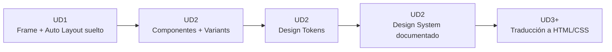
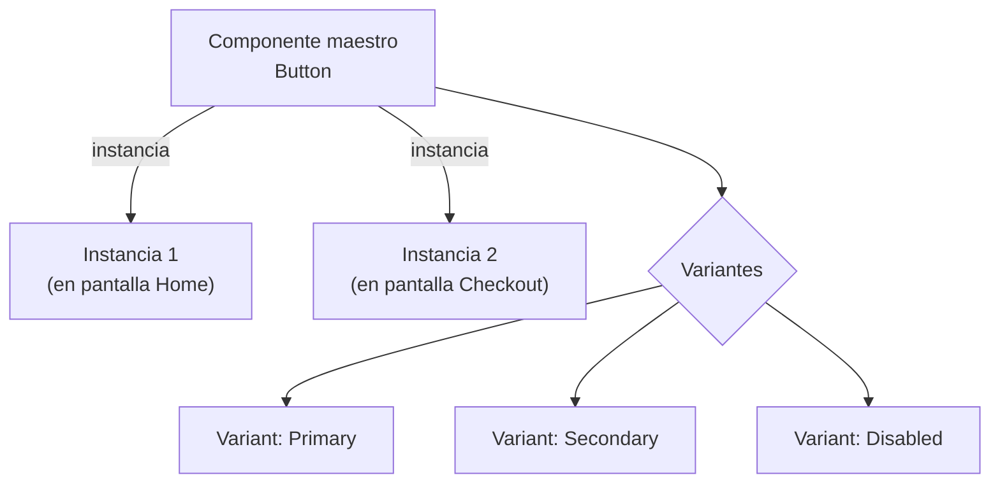
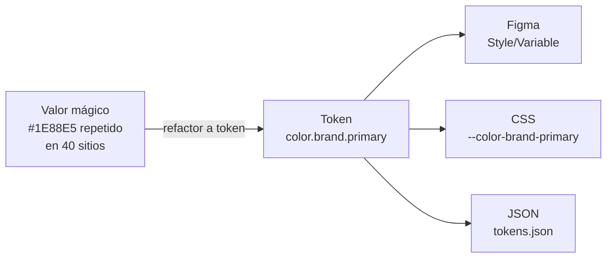
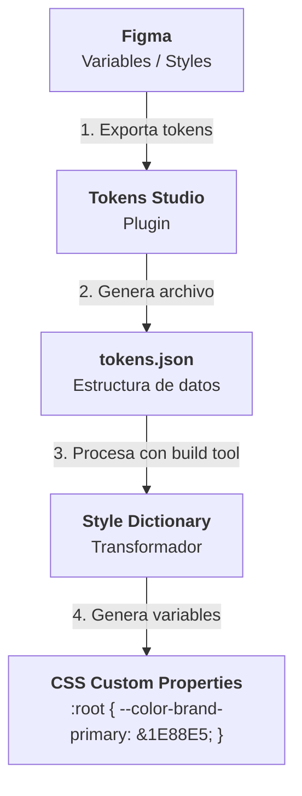
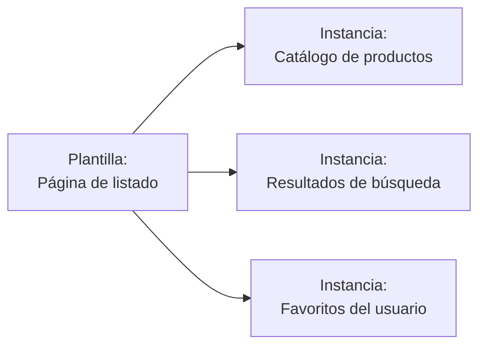
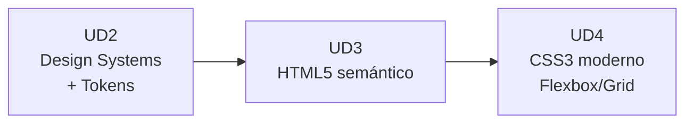

# UD2 · Figma Avanzado, Design Systems y Design Tokens :material-layers-triple:

## 1. De Figma base a Figma avanzado :material-arrow-decision-outline:

En la UD1 estudiamos Frames, capas y Auto Layout básico. Ahora formalizamos ese conocimiento en un flujo reutilizable y escalable: un **Design System**.

### 1.1 Auto Layout avanzado

| Propiedad | Qué controla | Equivalente CSS |
| --- | --- | --- |
| **Direction** (Horizontal/Vertical) | Eje principal de disposición | `flex-direction: row / column` |
| **Spacing between items** | Separación entre hijos | `gap` |
| **Padding** | Espaciado interno del contenedor | `padding` |
| **Resizing: Hug contents** | El contenedor se ajusta a su contenido | `width: fit-content` |
| **Resizing: Fill container** | El elemento ocupa el espacio disponible | `flex: 1 1 0%` / `width: 100%` |
| **Resizing: Fixed** | Tamaño fijo, no se adapta | `width: 200px` |
| **Auto Layout anidado** | Layouts dentro de layouts | Flexbox anidado (`div` dentro de `div` con `display: flex`) |

!!! tip "Pensar como desarrollador/a"
    Si al construir un componente en Figma te preguntas *"¿esto se comportaría como `flex: 1` o como `width: fit-content` en CSS?"*, ya estás aplicando mentalidad de ingeniería de software frontend.

---

### 1.2 Componentes, variantes e instancias

| Concepto | Definición | Analogía en código |
| --- | --- | --- |
| **Componente maestro** | La fuente única de verdad de un elemento reutilizable. | Una clase / componente de React, Vue o Svelte. |
| **Instancia** | Copia del maestro colocada en un diseño; hereda cambios del maestro. | Uso del componente `<Button />` en distintas vistas. |
| **Variante (Variant)** | Versión alternativa de un componente agrupada bajo el mismo nombre (ej. `Button/Primary`). | Props de un componente (`variant="primary"`). |
| **Override** | Cambio puntual en una instancia sin romper el vínculo con el maestro. | Sobrescribir un atributo o prop en un caso concreto. |

---

## 2. Design Tokens :material-poker-chip:

### 2.1 ¿Qué es un token de diseño?

Un **Design Token** es un valor de diseño (color, tamaño, tipografía, sombra...) almacenado bajo un **nombre semántico**, en lugar de utilizar un valor bruto ("mágico") repetido a lo largo del proyecto.

---

### 2.2 Categorías habituales de tokens

| Categoría | Ejemplo de nombre | Ejemplo de valor |
| --- | --- | --- |
| **Color** | `color.brand.primary` | `#1E88E5` |
| **Color semántico** | `color.feedback.error` | `#D32F2F` |
| **Tipografía** | `font.size.heading-1` | `2.441rem` |
| **Espaciado** | `space.md` | `16px` |
| **Radio de borde** | `radius.card` | `12px` |
| **Sombra** | `shadow.elevation-2` | `0 4px 8px rgba(0,0,0,.12)` |
| **Animación** | `motion.duration.fast` | `150ms` |

---

### 2.3 Tres niveles de tokens (Patrón industrial)

| Nivel | Nombre | Ejemplo | Propósito |
| --- | --- | --- | --- |
| **1** | **Global / Core** | `blue-500: #1E88E5` | Paleta bruta de la marca, sin intención de uso. |
| **2** | **Alias / Semántico** | `color-brand-primary: {blue-500}` | Le otorga un significado o contexto funcional al valor bruto. |
| **3** | **Component-specific** | `button-bg-primary: {color-brand-primary}` | Asignación directa ligada a la anatomía de un componente. |

!!! warning "Error común de arquitectura"
    Un fallo recurrente es omitir el **Nivel Semántico** y asignar valores brutos (`blue-500`) directamente a los componentes. Si el proyecto requiere implementar modo oscuro (*Dark Mode*) o un cambio de marca (*rebranding*), se deberán modificar decenas de componentes en lugar de redefinir un solo alias semántico.

---

### 2.4 De Figma a código: El pipeline de tokens

Este flujo formaliza la estrategia de **Single Source of Truth** (Fuente única de verdad): el token se define una sola vez en el software de diseño y se distribuye automáticamente a las hojas de estilo del proyecto en formato CSS/Tailwind.

---

## 3. Guía de estilo (RA1.d) :material-book-open-outline:

Una guía de estilo documenta **cómo** y **cuándo** deben aplicarse las reglas del sistema de diseño.

| Sección típica | Contenido técnico |
| --- | --- |
| **Principios de marca** | Tono de comunicación, valores y personalidad visual. |
| **Paleta de color** | Muestras de tokens de color indicando usos permitidos y combinaciones no accesibles. |
| **Tipografía** | Escala modular, pesos, altura de línea (`line-height`) y jerarquía semántica. |
| **Espaciado** | Grid base de espaciado (múltiplos de $4\text{px}$ u $8\text{px}$). |
| **Componentes** | Muestrario de componentes con todos sus estados (`default`, `hover`, `active`, `disabled`, `focus`). |
| **Iconografía** | Matriz de iconos vectoriales y normas de escala. |
| **UX Writing** | Patrones de redacción para mensajes de error, alertas y llamadas a la acción (CTAs). |

---

## 4. Plantillas de diseño (RA1.g) :material-file-document-multiple-outline:

Una plantilla (*template*) es un patrón estructural de alto nivel diseñado para acelerar el desarrollo de vistas manteniendo la consistencia de maquetación.

| Tipo de plantilla | Ejemplo de aplicación |
| --- | --- |
| **Plantilla de página** | Layout para "Página de listado" con cabecera, barra lateral de filtros, rejilla de resultados y paginación. |
| **Plantilla de componente** | Tarjeta de producto con áreas predefinidas (*placeholders*) para imagen, título, precio y botón CTA. |
| **Plantilla de flujo** | Flujo de proceso de pago (*Checkout*) en 3 pasos con barra de progreso y botones de navegación encadenados. |

---

## 5. Marcos, tablas y capas (RA1.f) :material-table-furniture:

Este criterio adapta la terminología histórica de la maquetación web a los estándares modernos de desarrollo e inspección de interfaces:

| Término de la especificación | Interpretación técnica actual | Implementación en el módulo |
| --- | --- | --- |
| **Marcos** (*Frames*) | Frames de Figma / Etiquetas semánticas `<section>` y `<main>`. | UD1 - UD2 (Figma) / UD3 (HTML5) |
| **Tablas de maquetación** | Sistema de cuadrícula **CSS Grid Layout**. | UD4 (CSS Layouts) |
| **Capas posicionadas** | Contenedores `
` estructurados con Flexbox, Grid y Auto Layout. | UD2 (Figma) / UD4 (CSS) |

---

## 6. Ejercicio práctico guiado :material-clipboard-check:

!!! info "Actividad de consolidación (no evaluable)"
    **Objetivo:** Construir un sistema de diseño reducido pero funcional en Figma, aplicando la arquitectura de tokens, componentes con variantes y exportación técnica.

**Pasos recomendados para practicar:**

1. **Estructura de Tokens:** Crea una colección de variables en Figma con al menos 8 tokens de color estructurados en 3 niveles (Global, Semántico, Componente) y 4 tokens de espaciado.
2. **Componente de Botón:** Crea un componente `Button` mediante Auto Layout con 3 variantes (`Primary`, `Secondary`, `Disabled`).
3. **Componente de Tarjeta:** Construye un componente `Card` que integre al menos 2 instancias del botón configurado previamente.
4. **Documentación de la Guía:** Organiza en una página de Figma un resumen de la paleta cromática, la escala tipográfica y las reglas de uso de cada componente.
5. **Exportación:** Utiliza el plugin *Tokens Studio for Figma* para generar y revisar el archivo ejecutable `tokens.json`.

---

## 7. Resumen y conexión con la siguiente unidad :material-link-variant:

* Un **Design System** es una arquitectura viva basada en tokens de diseño (global $\rightarrow$ semántico $\rightarrow$ componente) que garantiza escalabilidad y mantenibilidad.
* La **guía de estilo** (RA1.d) define las normas de aplicación técnica y no solo la estética visual.
* Con la finalización de esta unidad se concluye el bloque de diseño de interfaces visuales (**RA1**). A partir de la **UD3** iniciaremos la traducción de estas estructuras a código mediante **HTML5 semántico**.

---

## 8. Referencias y fuentes :material-book-open-page-variant:

* W3C — [Design Tokens Community Group Specification](https://www.designtokens.org/).
* Figma Help Center — [Guide to Variables in Figma](https://www.google.com/search?q=https://help.figma.com/hc/en-us/articles/15145852043159).
* Tokens Studio — [Tokens Studio for Figma Documentation](https://tokens.studio/).
