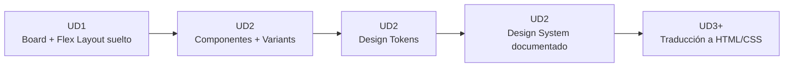
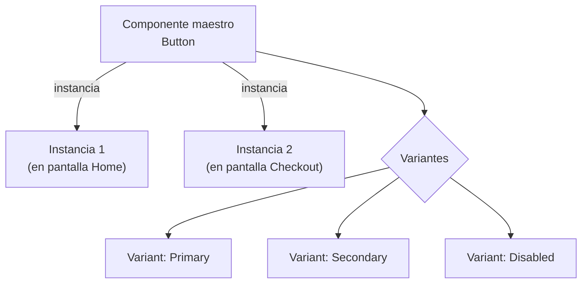
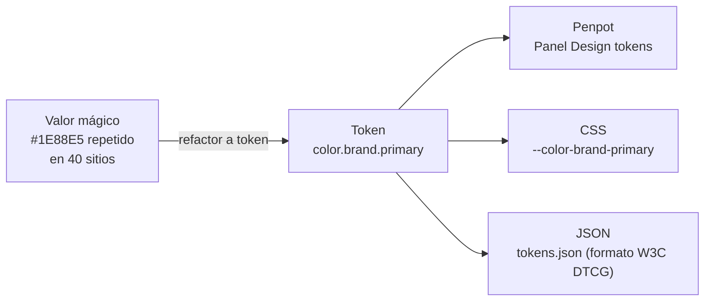
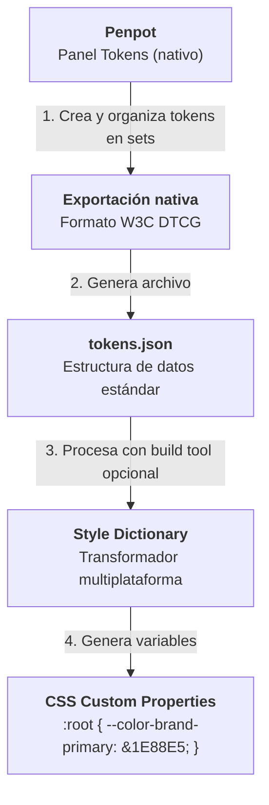
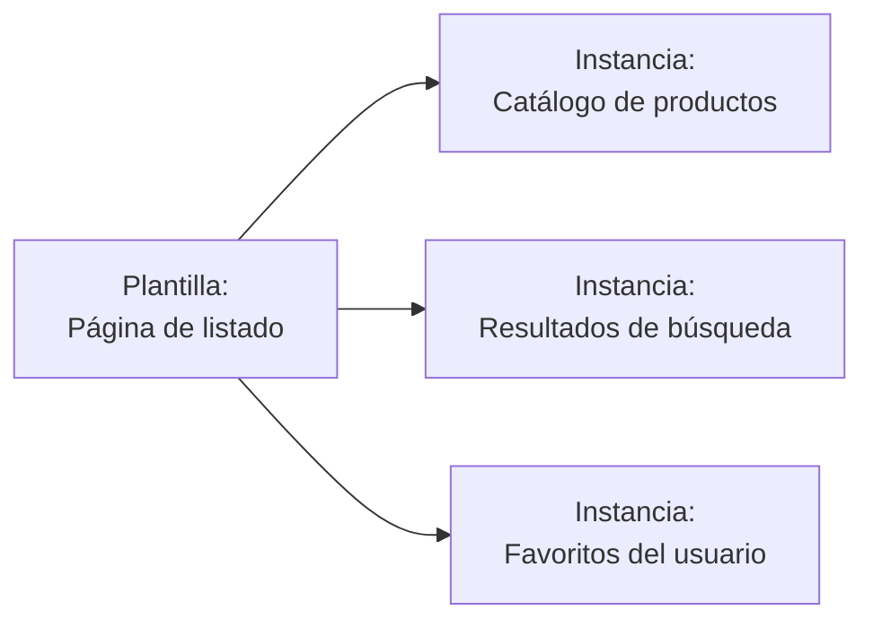
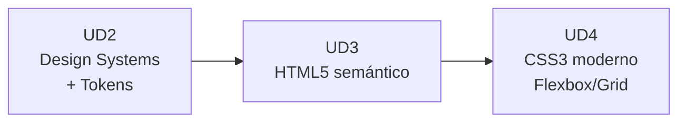

# UD2 · Penpot Avanzado, Design Systems y Design Tokens :material-layers-triple:

## 1. De Penpot base a Penpot avanzado :material-arrow-decision-outline:

En la UD1 estudiamos Boards, capas y Flex Layout básico, y diseñamos una primera versión de la ficha de producto de **AURIA**. Esa primera versión tiene un problema que todavía no hemos nombrado: cada color, cada espaciado y cada botón están definidos **de forma suelta**, sin ninguna relación entre sí. Si mañana el cliente pide cambiar el azul de marca, tocaría entrar elemento por elemento a mano.

Esta unidad resuelve exactamente ese problema. Formalizamos lo aprendido en un flujo reutilizable y escalable: un **Design System**.



!!! info "El hilo conductor sigue siendo AURIA"
    Todo lo que hagamos en esta unidad se aplica sobre el mismo archivo de la UD1. No vamos a crear nada desde cero: vamos a **sistematizar** lo que ya diseñaste, para que deje de depender de que tú recuerdes dónde usaste cada color.

### 1.1 Flex Layout avanzado

En UD1 usamos Flex Layout de forma básica (una fila, un `gap`). Ahora necesitamos controlar algo más fino: **cómo decide cada elemento su propio tamaño** dentro del contenedor. Esto tiene tres opciones en Penpot, y elegir la que no toca es una fuente constante de errores de maquetación:

| Propiedad | Qué controla | Equivalente CSS |
| --- | --- | --- |
| **Direction** (row/column/reverse) | Eje principal de disposición | `flex-direction: row / column` |
| **Gap** | Separación entre hijos | `gap` |
| **Padding** | Espaciado interno del contenedor | `padding` |
| **Sizing: Fit** | El contenedor se ajusta a su contenido | `width: fit-content` |
| **Sizing: Fill (100%)** | El elemento ocupa el espacio disponible | `flex: 1 1 0%` / `width: 100%` |
| **Sizing: Fix** | Tamaño fijo, no se adapta | `width: 200px` |
| **Flex Layout anidado** | Layouts dentro de layouts | Flexbox anidado (`div` dentro de `div` con `display: flex`) |

!!! example "Cómo distinguirlas sin dudar"
    Piensa en tres tipos de envase: **Fix** es una caja de cartón de tamaño fijo — si metes algo grande, se desborda. **Fit** es una bolsa de tela elástica — se ciñe exactamente a lo que metas dentro. **Fill** es agua dentro de un vaso — ocupa todo el espacio disponible del recipiente, sea cual sea su tamaño.

    En la ficha de AURIA: el botón "Añadir al carrito" usa **Fit** (se ajusta al texto "Añadir al carrito", ni un píxel más); en móvil, ese mismo botón pasa a **Fill** para ocupar todo el ancho de la pantalla; y el icono de favoritos junto al botón usa **Fix** a `24×24px`, porque un icono nunca debería cambiar de tamaño según el contenido de alrededor.

!!! tip "Pensar como desarrollador/a"
    Penpot no traduce libremente el vocabulario: sus propiedades de Flex Layout se llaman igual que en CSS (`row`, `column`, `gap`, `align-items`, `justify-content`). Si en Penpot configuras `justify-content: space-between`, ese es exactamente el nombre de la propiedad que vas a escribir después en tu hoja de estilos.

??? question "Autoevaluación"
    Tienes una barra de navegación con el logo a la izquierda y tres enlaces a la derecha, y quieres que ese espacio entre el logo y los enlaces crezca o se reduzca según el ancho de pantalla, sin que ni el logo ni los enlaces cambien de tamaño. ¿Qué propiedad de Flex Layout usarías, más allá del Sizing de cada elemento?

    **Respuesta:** `justify-content: space-between` en el contenedor — reparte el espacio *entre* los elementos sin necesidad de tocar el Sizing individual de cada uno (que seguiría siendo Fit para el logo y los enlaces).

---

### 1.2 Componentes, variantes e instancias

Hasta ahora, cada botón de tu ficha de producto es una forma independiente: si tienes 6 botones "Añadir al carrito" repetidos en distintas pantallas y cambias el color de uno, los otros 5 no se enteran. Un **componente** resuelve esto convirtiendo un elemento en una plantilla maestra de la que todas las copias dependen.



| Concepto | Definición | Analogía | Analogía en código |
| --- | --- | --- | --- |
| **Componente maestro** | La fuente única de verdad de un elemento reutilizable. | El molde metálico con el que cortas galletas. | Una clase / componente de React, Vue o Svelte. |
| **Instancia** | Copia del maestro colocada en un diseño; hereda cambios del maestro. | Cada galleta hecha con ese molde. | Uso del componente `<Button />` en distintas vistas. |
| **Variante (Variant)** | Versión alternativa de un componente agrupada bajo el mismo nombre (ej. `Button/Primary`). | El mismo menú de hamburguesa, en tamaño Normal / Grande / Familiar. | Props de un componente (`variant="primary"`). |
| **Override** | Cambio puntual en una instancia sin romper el vínculo con el maestro. | Añadir chocolate a una galleta en concreto, sin tocar el molde. | Sobrescribir un atributo o prop en un caso concreto. |

!!! danger "El error que vas a cometer si no lo lees ahora"
    Copiar y pegar un botón con `Ctrl+C` / `Ctrl+V` **no** crea una instancia — crea una forma independiente que no hereda nada del maestro. Solo son instancias reales las que arrastras desde el panel **Assets**, o las que Penpot crea automáticamente cuando duplicas una instancia ya existente (no el componente maestro). Si más adelante cambias el maestro y algunos botones "no se actualizan", casi seguro que el problema es este.

!!! note "Variants en Penpot"
    Penpot incorpora un sistema de **Variantes** que agrupa varios componentes similares bajo un único componente "padre" con propiedades configurables (por ejemplo, `tipo` = Primary/Secondary/Ghost y `estado` = Default/Disabled combinados), del mismo modo que defines las *props* de un componente en código.

??? question "Autoevaluación"
    Tienes un componente `Button` con 3 instancias en tu archivo. Cambias el radio de esquina del componente maestro de `4px` a `12px`. Una de las instancias tenía un override que fijaba su color de fondo a un rojo de aviso. Tras el cambio, ¿qué aspecto tiene esa instancia con override?

    **Respuesta:** El radio de esquina cambia a `12px` en las tres instancias (heredado del maestro), **pero** el color rojo del override se mantiene en esa instancia concreta — un override solo bloquea la propiedad que tú modificaste a mano, el resto sigue heredando del maestro con total normalidad.

---

## 2. Design Tokens :material-poker-chip:

### 2.1 ¿Qué es un token de diseño, y por qué no basta con "poner el color bien"?

Vuelve un momento a tu archivo de UD1. Es muy probable que el azul de marca de AURIA (`#1E88E5`, por ejemplo) esté pegado directamente en el relleno de 10 o 15 elementos distintos: el botón, el logo, algún icono, el borde de una tarjeta... Ese valor repetido y suelto tiene un nombre en la industria: **valor mágico**. Y es un problema concreto, no una cuestión de estilo: si mañana cambia el azul de marca, tienes que localizar y corregir esos 15 sitios uno por uno, a mano, con el riesgo de dejarte alguno.

Un **Design Token** es la solución: un valor de diseño (color, tamaño, tipografía, sombra...) que guardas **una sola vez**, bajo un **nombre semántico**, y al que todos los elementos que lo necesiten apuntan por referencia — no por copia.



!!! success "Penpot y los tokens nativos"
    Penpot fue la primera herramienta de diseño en integrar **Design Tokens de forma nativa**, co-creados junto a Tokens Studio y publicados bajo el estándar abierto del **W3C Design Tokens Community Group (DTCG)**. Esto significa que en este módulo **no necesitamos ningún plugin de terceros**: los tokens se crean, organizan y aplican desde la propia pestaña **Tokens** del panel izquierdo.

---

### 2.2 Categorías habituales de tokens

| Categoría | Ejemplo de nombre | Ejemplo de valor |
| --- | --- | --- |
| **Color** | `color.brand.primary` | `#1E88E5` |
| **Color semántico** | `color.feedback.error` | `#D32F2F` |
| **Tipografía** | `font.size.heading-1` | `2.441rem` |
| **Espaciado** | `space.md` | `16px` |
| **Radio de borde** | `radius.card` | `12px` |
| **Sombra** | `shadow.elevation-2` | `0 4px 8px rgba(0,0,0,.12)` |
| **Rotación / Ancho de borde / Opacidad** | `border-width.thick` | `2px` |

Penpot admite de forma nativa los tipos de token **color, radio, dimensión, tamaño, espaciado, rotación, ancho de borde y opacidad**, todos ellos en el formato estándar del W3C.

---

### 2.3 Tres niveles de tokens (Patrón industrial)

Esta es, con diferencia, la parte más importante de toda la unidad — y la que más cuesta interiorizar a la primera. Antes de ver la tabla técnica, piensa en algo que ya usas todos los días: **la agenda de contactos de tu móvil.**

!!! example "La analogía que lo explica todo: tu agenda de contactos"
    Imagina el número de teléfono de tu madre: `612 345 678`. Ese es un dato en bruto — solo dígitos, sin ningún significado por sí solo. Ahora imagina que le pones el nombre **"Mamá"** a ese contacto. De repente ese número tiene un significado funcional: sabes exactamente para qué sirve, sin memorizar los dígitos. Y si tu madre cambia de número mañana, solo actualizas **una cosa** — el contacto "Mamá" — y todo lo demás (tus chats, tu registro de llamadas) sigue funcionando sin que tengas que tocar nada más.

    Ahora ve un paso más allá: configuras que, cuando llame "Mamá" en concreto, suene un tono de llamada distinto al resto de contactos. Esa es una decisión de uso muy específica, ligada a ese contacto en particular — no a todos los números de tu agenda.

    Esos tres pasos — el número en bruto, el nombre con significado, la decisión de uso concreta — son **exactamente** los tres niveles de un sistema de tokens.

| Nivel | Nombre | Ejemplo | Propósito | Equivalente en la analogía |
| --- | --- | --- | --- | --- |
| **1** | **Global / Core** | `blue-500: #1E88E5` | Paleta bruta de la marca, sin intención de uso. | El número en bruto: `612 345 678` |
| **2** | **Alias / Semántico** | `color-brand-primary: {blue-500}` | Le otorga un significado o contexto funcional al valor bruto. | El nombre del contacto: "Mamá" |
| **3** | **Component-specific** | `button-bg-primary: {color-brand-primary}` | Asignación directa ligada a la anatomía de un componente. | El tono de llamada especial para ese contacto |

En Penpot, esta jerarquía se construye organizando los tokens en **sets** (conjuntos) dentro del panel Tokens, y cada token puede referenciar a otro mediante llaves (`{blue-500}`), exactamente igual que en el ejemplo de la tabla.

!!! warning "Error común de arquitectura"
    Un fallo recurrente es omitir el **Nivel Semántico** y asignar valores brutos (`blue-500`) directamente a los componentes. Es como si, en vez de guardar el contacto "Mamá", pegaras el número en bruto directamente en cada chat de WhatsApp donde lo necesitas: el día que cambie el número, tendrías que ir conversación por conversación corrigiéndolo a mano. Si el proyecto requiere implementar modo oscuro (*Dark Mode*) o un cambio de marca (*rebranding*), se deberán modificar decenas de componentes en lugar de redefinir un solo alias semántico. En Penpot, cuando cambias un token, **cualquier componente que lo use se actualiza automáticamente** — no necesitas rastrear manualmente dónde se aplicó.

!!! example "El ejemplo completo, con AURIA, de principio a fin"
    Vamos a seguir un solo color a través de los tres niveles, tal y como lo harías en tu propia práctica:

    1. **Creas el token global** `blue-500` con el valor `#1E88E5`. Todavía no significa nada — es solo un color guardado con un nombre técnico.
    2. **Creas el token semántico** `color-brand-primary` y le das el valor `{blue-500}` (una referencia, no un color nuevo). Ahora ese azul tiene un papel: "este es el color principal de la marca AURIA".
    3. **Creas el token de componente** `button-bg-primary` con el valor `{color-brand-primary}`, y se lo aplicas al relleno de tu componente `Button/Primary`.
    4. **La prueba de que está bien hecho:** el cliente AURIA decide cambiar su color de marca de azul a un verde corporativo. Tú solo cambias **un valor** — el de `blue-500` — y automáticamente el botón, el logo y cualquier otro elemento que dependa de `color-brand-primary` se actualizan solos, sin tocarlos uno por uno.

??? question "Autoevaluación — la pregunta que de verdad importa"
    Si mañana AURIA cambia su color de marca y tuvieras que tocar **más de un token** para que se reflejara en todo el archivo, ¿qué te indicaría eso sobre cómo has construido tu jerarquía?

    **Respuesta:** Que en algún sitio te has saltado el nivel semántico y has aplicado el token global directamente a un componente — exactamente el error de "pegar el número en bruto en el chat" en vez de guardar el contacto. La señal de que los 3 niveles están bien construidos es que **un solo cambio en el nivel 1 se propaga solo** a todo lo demás.

---

### 2.4 De Penpot a código: El pipeline de tokens



Este flujo formaliza la estrategia de **Single Source of Truth** (Fuente única de verdad): el token se define una sola vez, directamente en Penpot, y se distribuye automáticamente a las hojas de estilo del proyecto en formato CSS/Tailwind, sin pasar por ninguna herramienta intermedia de terceros para el paso de exportación.

!!! example "Qué aspecto tiene realmente el archivo exportado"
    Al exportar desde el panel Tokens, obtienes un archivo `tokens.json` con una estructura parecida a esta — no es magia, es texto plano y legible:

    ```json
    {
      "color": {
        "blue-500": { "value": "#1E88E5", "type": "color" },
        "brand-primary": { "value": "{color.blue-500}", "type": "color" },
        "button-bg-primary": { "value": "{color.brand-primary}", "type": "color" }
      }
    }
    ```

    Fíjate en que la estructura del JSON refleja exactamente los 3 niveles que acabamos de explicar: cada token de nivel superior referencia al anterior entre llaves `{ }`, igual que en Penpot.

---

## 3. Guía de estilo (RA1.d) :material-book-open-outline:

Una guía de estilo documenta **cómo** y **cuándo** deben aplicarse las reglas del sistema de diseño. No es el catálogo de colores en sí (eso ya lo tienes en los tokens) — es el documento que explica el criterio de uso, para que cualquier persona que se incorpore al proyecto no tenga que adivinar nada.

| Sección típica | Contenido técnico |
| --- | --- |
| **Principios de marca** | Tono de comunicación, valores y personalidad visual. |
| **Paleta de color** | Muestras de tokens de color indicando usos permitidos y combinaciones no accesibles. |
| **Tipografía** | Escala modular, pesos, altura de línea (`line-height`) y jerarquía semántica. |
| **Espaciado** | Grid base de espaciado (múltiplos de $4\text{px}$ u $8\text{px}$). |
| **Componentes** | Muestrario de componentes con todos sus estados (`default`, `hover`, `active`, `disabled`, `focus`). |
| **Iconografía** | Matriz de iconos vectoriales y normas de escala. |
| **UX Writing** | Patrones de redacción para mensajes de error, alertas y llamadas a la acción (CTAs). |

---

## 4. Plantillas de diseño (RA1.g) :material-file-document-multiple-outline:

Una plantilla (*template*) es un patrón estructural de alto nivel diseñado para acelerar el desarrollo de vistas manteniendo la consistencia de maquetación. Piensa en ella como "la versión a nivel de página" de lo que un componente es a nivel de elemento individual: en vez de reutilizar un botón, reutilizas la disposición completa de una pantalla.

| Tipo de plantilla | Ejemplo de aplicación |
| --- | --- |
| **Plantilla de página** | Layout para "Página de listado" con cabecera, barra lateral de filtros, rejilla de resultados y paginación. |
| **Plantilla de componente** | Tarjeta de producto con áreas predefinidas (*placeholders*) para imagen, título, precio y botón CTA. |
| **Plantilla de flujo** | Flujo de proceso de pago (*Checkout*) en 3 pasos con barra de progreso y botones de navegación encadenados. |



!!! example "Aplicado a AURIA"
    Si defines una plantilla de "Página de listado de productos" reutilizando tu componente `Card`, añadir un segundo modelo de auriculares al catálogo (por ejemplo "Auria Mini") no debería obligarte a rediseñar nada — solo a colocar una instancia más de la tarjeta, con sus propios datos.

---

## 5. Marcos, tablas y capas (RA1.f) :material-table-furniture:

Este criterio adapta la terminología histórica de la maquetación web a los estándares modernos de desarrollo e inspección de interfaces:

| Término de la especificación | Interpretación técnica actual | Implementación en el módulo |
| --- | --- | --- |
| **Marcos** (*Frames*) | Boards de Penpot / Etiquetas semánticas `<section>` y `<main>`. | UD1 - UD2 (Penpot) / UD3 (HTML5) |
| **Tablas de maquetación** | Sistema de cuadrícula **CSS Grid Layout** (también disponible como Grid Layout nativo en Penpot). | UD4 (CSS Layouts) |
| **Capas posicionadas** | Contenedores `<div>` estructurados con Flexbox, Grid y Flex/Grid Layout. | UD2 (Penpot) / UD4 (CSS) |

---

## 6. Ejercicio práctico guiado :material-clipboard-check:

!!! info "Actividad de consolidación (no evaluable)"
    **Objetivo:** Construir un sistema de diseño reducido pero funcional en Penpot, aplicando la arquitectura de tokens, componentes con variantes y exportación técnica.


**Pasos recomendados para practicar:**

1. **Estructura de Tokens:** Crea una colección de **Design Tokens** en el panel Tokens de Penpot con al menos 8 tokens de color estructurados en 3 niveles (Global, Semántico, Componente) y 4 tokens de espaciado.
2. **Componente de Botón:** Crea un componente `Button` mediante Flex Layout con 3 variantes (`Primary`, `Secondary`, `Disabled`) usando el sistema de **Variants** de Penpot.
3. **Componente de Tarjeta:** Construye un componente `Card` que integre al menos 2 instancias del botón configurado previamente.
4. **Documentación de la Guía:** Organiza en una página de Penpot un resumen de la paleta cromática, la escala tipográfica y las reglas de uso de cada componente.
5. **Exportación:** Exporta la colección de tokens directamente desde el panel **Tokens** de Penpot (`Export` → JSON) para obtener el archivo ejecutable `tokens.json` en formato W3C DTCG — sin necesidad de ningún plugin externo.

!!! tip "Si te atascas en el paso 1"
    Empieza siempre por los tokens globales (los colores en bruto que ya elegiste en UD1), después nómbralos semánticamente según su función (marca, error, éxito...), y solo al final crea los tokens de componente. Si intentas crear los tres niveles a la vez, es fácil perder el hilo de qué referencia a qué.


---

## 7. Resumen y conexión con la siguiente unidad :material-link-variant:

* Un **Design System** es una arquitectura viva basada en tokens de diseño (global $\rightarrow$ semántico $\rightarrow$ componente) que garantiza escalabilidad y mantenibilidad.
* La **guía de estilo** (RA1.d) define las normas de aplicación técnica y no solo la estética visual.
* Con la finalización de esta unidad se concluye el bloque de diseño de interfaces visuales (**RA1**). A partir de la **UD3** iniciaremos la traducción de estas estructuras a código mediante **HTML5 semántico**.



!!! question "Antes de pasar a la UD3, pregúntate..."
    * Si tuviera que cambiar el color de marca de AURIA ahora mismo, ¿cuántos tokens necesitaría tocar? (La respuesta correcta es **uno**.)
    * ¿Sabría explicar, sin mirar la tabla, la diferencia entre una instancia y una copia pegada con Ctrl+V?
    * ¿Mi archivo `tokens.json` exportado refleja de verdad los 3 niveles, o tiene todo mezclado en uno?

---

## 8. Referencias y fuentes :material-book-open-page-variant:

* W3C — [Design Tokens Community Group Specification](https://www.designtokens.org/).
* Penpot — [Design Tokens with Penpot (documentación oficial)](https://penpot.app/blog/design-tokens-with-penpot/).
* Penpot Help Center — [Guía de Design Tokens](https://help.penpot.app/).
* Tokens Studio — [Bringing native Design Tokens to Penpot](https://tokens.studio/blog/bringing-design-tokens-to-penpot-an-open-source-collaboration-for-the-design-systems-community).
