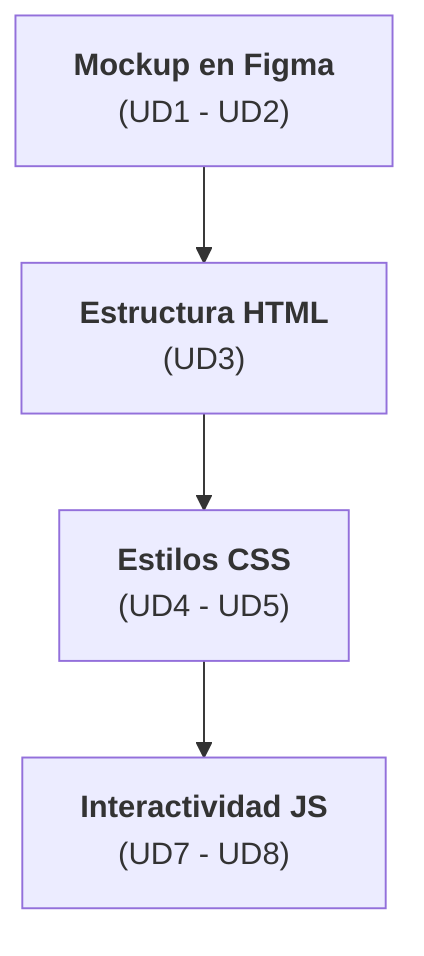
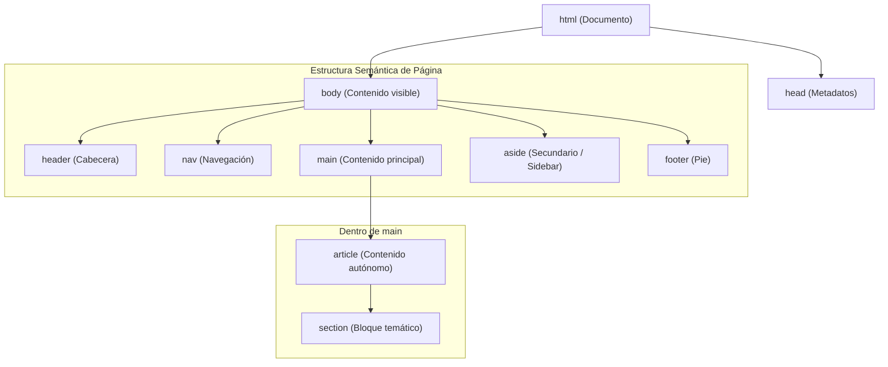
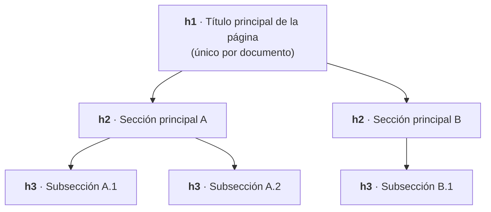
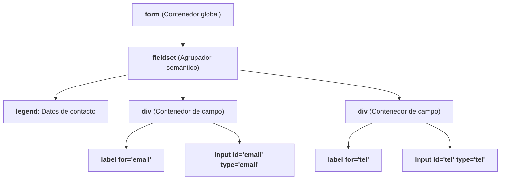
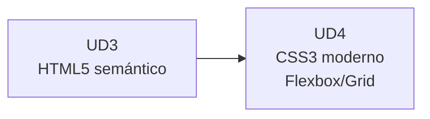

# UD3 · HTML5 Semántico, Estructura Accesible y Formularios :material-language-html5:

## 1. De Figma a HTML: primer paso al código :material-arrow-decision-outline:

El primer error habitual al pasar de diseño a código es maquetar pensando en "cómo se ve" en vez de "qué es". El HTML5 semántico obliga a hacerse la pregunta correcta: **¿qué tipo de contenido es esto?**, no **¿qué aspecto tiene?**

---

## 2. Estructura semántica del documento :material-sitemap:

### 2.1 Elementos de estructura de página

| Elemento | Propósito | Puede repetirse |
| --- | --- | --- |
| `<header>` | Cabecera de la página o de una sección | Sí (uno por `<article>`/`<section>` si aplica) |
| `<nav>` | Bloque de navegación principal | Sí, con moderación |
| `<main>` | Contenido principal único de la página | No — solo uno por documento |
| `<article>` | Contenido autónomo y distribuible (post, noticia, comentario) | Sí |
| `<section>` | Agrupación temática con su propio encabezado | Sí |
| `<aside>` | Contenido relacionado pero secundario (sidebar, publicidad) | Sí |
| `<footer>` | Pie de página o de sección | Sí |

!!! tip "Regla de decisión rápida"
    Si al extraer el elemento de su contexto (por ejemplo, mandarlo a un lector RSS) el contenido sigue teniendo sentido pleno por sí solo, es un `<article>`. Si necesita del contexto de la página para entenderse, es un `<section>` o un `
`.

---

### 2.2 `
`/`` vs. elementos semánticos

| Situación | Elemento correcto | Por qué |
| --- | --- | --- |
| Agrupar visualmente sin significado propio | `
` | Es el contenedor neutro por definición |
| Resaltar texto en línea sin significado propio | `` | Equivalente en línea de `
` |
| Un bloque que representa una noticia completa | `<article>` | Tiene significado semántico autónomo |
| Un bloque de navegación | `<nav>` | Los lectores de pantalla lo anuncian como punto de referencia (*landmark*) |
| Una cita textual de otra fuente | `<blockquote>` | Semántica específica, no un `
` con estilos de cita |

!!! warning "El peligro de la 'divitis'"
    Usar `
` para todo no rompe la página visualmente, pero sí destruye la **navegación por landmarks** de los lectores de pantalla. Este es el motivo por el que **RA2.a** existe como criterio independiente. Lo evaluaremos en profundidad en la auditoría de accesibilidad del **RA5** (UD9-UD10).

---

## 3. Jerarquía de encabezados y outline del documento :material-format-header-pound:

Los encabezados (`<h1>`-`<h6>`) no son selectores de tamaño visual: construyen la **estructura jerárquica** (*outline*) del documento que la tecnología asistiva navega como un índice.

| Regla | Correcto | Incorrecto |
| --- | --- | --- |
| **Un único `<h1>` por página** | `<h1>Catálogo de productos</h1>` | Varios `<h1>` compitiendo por ser el título principal |
| **No saltar niveles** | `h1 → h2 → h3` | `h1 → h3` (omite el nivel h2) |
| **No elegir el nivel por tamaño visual** | `<h2>` aunque se deba ver pequeño | Usar `<h4>` solo "porque se ve chico" (eso se estiliza con CSS) |

---

## 4. Formularios web :material-form-select:

### 4.1 Tipos de `input` más usados

| Tipo | Uso | Ventaja sobre `type="text"` genérico |
| --- | --- | --- |
| `email` | Correo electrónico | Valida formato y despliega teclado específico en móviles |
| `tel` | Teléfono | Despliega teclado numérico telefónico en móviles |
| `number` | Valores numéricos | Controles de incremento/decremento y validación de rango |
| `date` | Fechas | Selector de calendario nativo del sistema |
| `url` | Direcciones web | Valida sintaxis de URL |
| `password` | Contraseñas | Enmascara los caracteres introducidos |
| `search` | Campos de búsqueda | Semántica específica y botón de borrado rápido en navegadores |
| `checkbox` / `radio` | Selección múltiple / única | Comportamiento nativo accesible por teclado |

---

### 4.2 Estructura accesible de un formulario

| Elemento | Función | Por qué es obligatorio |
| --- | --- | --- |
| `<label for="id">` | Vincula el texto descriptivo al campo | Sin esta relación, un lector de pantalla no anuncia la función del campo al recibir el foco. |
| `<fieldset>` + `<legend>` | Agrupa campos con un título temático | Otorga contexto completo cuando hay múltiples inputs similares (ej. dirección de envío vs. facturación). |
| Atributo `required` | Marca la obligatoriedad del campo | Validación nativa accesible del navegador sin depender de JS. |
| Atributo `aria-describedby` | Asocia mensajes de ayuda o error | Anuncia las instrucciones de ayuda o alertas al situarse sobre el control. |

---

### 4.3 Validación nativa vs. JavaScript

| Validación | Cuándo usarla | Ejemplo |
| --- | --- | --- |
| **Nativa HTML5** (`required`, `pattern`, `min`, `max`) | Reglas simples de formato, longitud o rango | `<input type="email" required>` |
| **JavaScript** | Reglas de negocio complejas (ej. "las contraseñas deben coincidir") | Se trabajará en la **UD8** (RA4, manipulación del DOM) |

!!! note "Validación en servidor"
    La validación nativa en cliente mejora la experiencia de usuario (UX), pero nunca sustituye a la validación en el *backend*. Todo dato debe ser revalidado en el servidor antes de ser procesado.

---

## 5. Ejercicio práctico guiado :material-clipboard-check:

!!! info "Actividad de consolidación (no evaluable)"
    **Objetivo:** Traducir a HTML5 semántico y accesible la estructura de interfaz diseñada previamente en Figma (UD1-UD2).

**Pasos recomendados para practicar:**

1. **Estructura Base:** Define el esqueleto del documento con `<header>`, `<main>`, `<footer>` y un bloque `<nav>`.
2. **Maquetación del Producto:** Utiliza las etiquetas `<article>` o `<section>` de forma justificada para encapsular la ficha del producto.
3. **Formulario de Reseñas:** Construye un formulario de "Añadir reseña" integrando `<fieldset>`, `<legend>`, etiquetas `<label>` vinculadas por `for`/`id` y al menos 3 tipos de `input` específicos (`email`, `number`, `date`, etc.).
4. **Auditoría de Outline:** Comprueba el árbol de encabezados con la extensión *HeadingsMap* para garantizar que no existan saltos de nivel (`h1` $\rightarrow$ `h3`).
5. **Validación:** Comprueba la sintaxis de tu código con la herramienta oficial [W3C Markup Validator](https://validator.w3.org/).

---

## 6. Resumen y conexión con la siguiente unidad :material-link-variant:

* El HTML5 semántico transmite intención técnica a los motores de búsqueda y tecnologías de asistencia.
* La accesibilidad en formularios no es un añadido estético: comienza por la correcta vinculación técnica entre `<label>` y sus `<input>`.
* Con la estructura semántica construida, en la **UD4** aplicaremos la capa visual mediante **CSS3**: cascada, especificidad y layouts avanzados (Flexbox y Grid).

---

## 7. Referencias y fuentes :material-book-open-page-variant:

* MDN Web Docs — [HTML elements reference](https://developer.mozilla.org/es/docs/Web/HTML/Element).
* W3C — [Markup Validation Service](https://validator.w3.org/).
* WebAIM — [Creating Accessible Forms](https://webaim.org/techniques/forms/).
