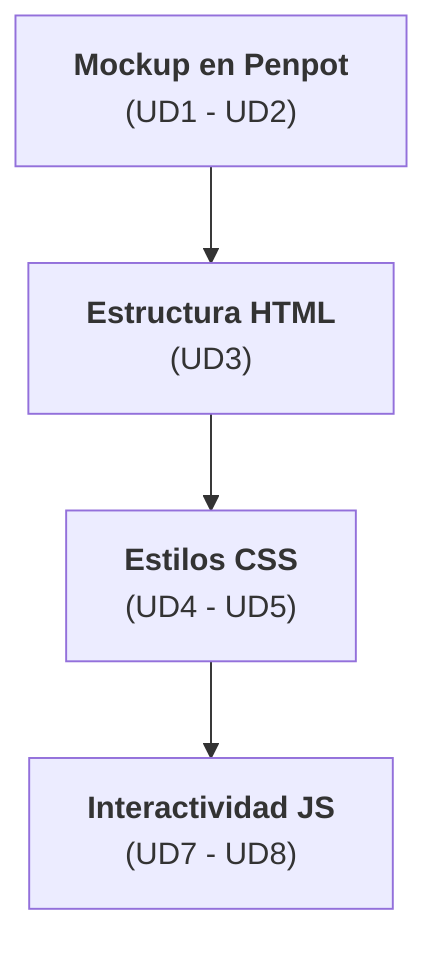
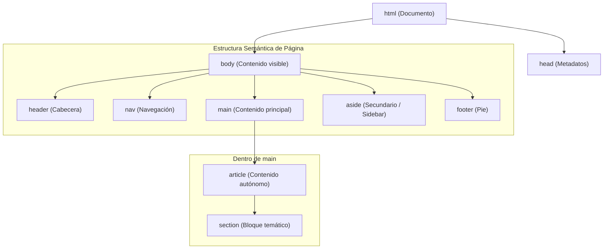
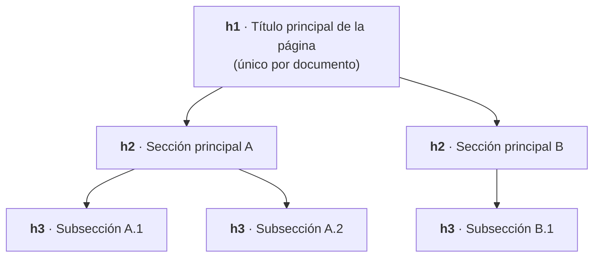
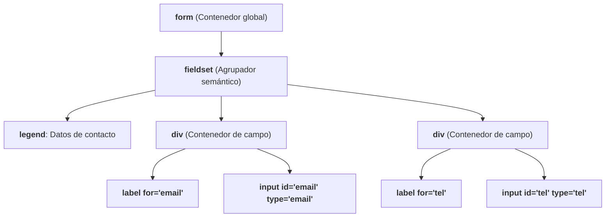
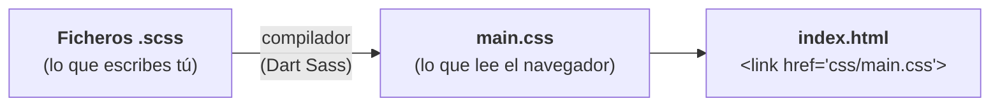
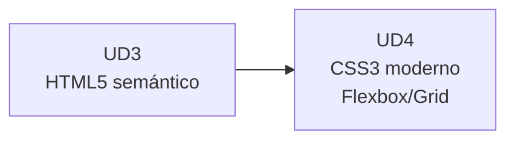

# UD3 · HTML5 Semántico, Estructura Accesible y Formularios :material-language-html5:

## 1. De Penpot a HTML: primer paso al código :material-arrow-decision-outline:



El primer error habitual al pasar de diseño a código es maquetar pensando en "cómo se ve" en vez de "qué es". El HTML5 semántico obliga a hacerse la pregunta correcta: **¿qué tipo de contenido es esto?**, no **¿qué aspecto tiene?**

---

## 2. Estructura semántica del documento :material-sitemap:

### 2.1 Elementos de estructura de página

| Elemento | Propósito | Puede repetirse |
| --- | --- | --- |
| `<header>` | Cabecera de la página o de una sección | Sí (uno por `<article>`/`<section>` si aplica) |
| `<nav>` | Bloque de navegación principal | Sí, con moderación |
| `<main>` | Contenido principal único de la página | No — solo uno por documento |
| `<article>` | Contenido autónomo y distribuible (post, noticia, comentario) | Sí |
| `<section>` | Agrupación temática con su propio encabezado | Sí |
| `<aside>` | Contenido relacionado pero secundario (sidebar, publicidad) | Sí |
| `<footer>` | Pie de página o de sección | Sí |



!!! tip "Regla de decisión rápida"
    Si al extraer el elemento de su contexto (por ejemplo, mandarlo a un lector RSS) el contenido sigue teniendo sentido pleno por sí solo, es un `<article>`. Si necesita del contexto de la página para entenderse, es un `<section>` o un `<div>`.

---

### 2.2 `<div>`/`<span>` vs. elementos semánticos

| Situación | Elemento correcto | Por qué |
| --- | --- | --- |
| Agrupar visualmente sin significado propio | `<div>` | Es el contenedor neutro por definición |
| Resaltar texto en línea sin significado propio | `<span>` | Equivalente en línea de `<div>` |
| Un bloque que representa una noticia completa | `<article>` | Tiene significado semántico autónomo |
| Un bloque de navegación | `<nav>` | Los lectores de pantalla lo anuncian como punto de referencia (*landmark*) |
| Una cita textual de otra fuente | `<blockquote>` | Semántica específica, no un `<div>` con estilos de cita |

!!! warning "El peligro de la 'divitis'"
    Usar `<div>` para todo no rompe la página visualmente, pero sí destruye la **navegación por landmarks** de los lectores de pantalla. Este es el motivo por el que **RA2.a** existe como criterio independiente. Lo evaluaremos en profundidad en la auditoría de accesibilidad del **RA5** (UD9-UD10).

---

## 3. Jerarquía de encabezados y outline del documento :material-format-header-pound:

Los encabezados (`<h1>`-`<h6>`) no son selectores de tamaño visual: construyen la **estructura jerárquica** (*outline*) del documento que la tecnología asistiva navega como un índice.



| Regla | Correcto | Incorrecto |
| --- | --- | --- |
| **Un único `<h1>` por página** | `<h1>Catálogo de productos</h1>` | Varios `<h1>` compitiendo por ser el título principal |
| **No saltar niveles** | `h1 → h2 → h3` | `h1 → h3` (omite el nivel h2) |
| **No elegir el nivel por tamaño visual** | `<h2>` aunque se deba ver pequeño | Usar `<h4>` solo "porque se ve chico" (eso se estiliza con CSS) |

---

## 4. Formularios web :material-form-select:

### 4.1 Tipos de `input` más usados

| Tipo | Uso | Ventaja sobre `type="text"` genérico |
| --- | --- | --- |
| `email` | Correo electrónico | Valida formato y despliega teclado específico en móviles |
| `tel` | Teléfono | Despliega teclado numérico telefónico en móviles |
| `number` | Valores numéricos | Controles de incremento/decremento y validación de rango |
| `date` | Fechas | Selector de calendario nativo del sistema |
| `url` | Direcciones web | Valida sintaxis de URL |
| `password` | Contraseñas | Enmascara los caracteres introducidos |
| `search` | Campos de búsqueda | Semántica específica y botón de borrado rápido en navegadores |
| `checkbox` / `radio` | Selección múltiple / única | Comportamiento nativo accesible por teclado |

---

### 4.2 Estructura accesible de un formulario



| Elemento | Función | Por qué es obligatorio |
| --- | --- | --- |
| `<label for="id">` | Vincula el texto descriptivo al campo | Sin esta relación, un lector de pantalla no anuncia la función del campo al recibir el foco. |
| `<fieldset>` + `<legend>` | Agrupa campos con un título temático | Otorga contexto completo cuando hay múltiples inputs similares (ej. dirección de envío vs. facturación). |
| Atributo `required` | Marca la obligatoriedad del campo | Validación nativa accesible del navegador sin depender de JS. |
| Atributo `aria-describedby` | Asocia mensajes de ayuda o error | Anuncia las instrucciones de ayuda o alertas al situarse sobre el control. |

---

### 4.3 Validación nativa vs. JavaScript

| Validación | Cuándo usarla | Ejemplo |
| --- | --- | --- |
| **Nativa HTML5** (`required`, `pattern`, `min`, `max`) | Reglas simples de formato, longitud o rango | `<input type="email" required>` |
| **JavaScript** | Reglas de negocio complejas (ej. "las contraseñas deben coincidir") | Se trabajará en la **UD8** (RA4, manipulación del DOM) |

!!! note "Validación en servidor"
    La validación nativa en cliente mejora la experiencia de usuario (UX), pero nunca sustituye a la validación en el *backend*. Todo dato debe ser revalidado en el servidor antes de ser procesado.

---

## 5. Ejercicio práctico guiado :material-clipboard-check:

!!! info "Actividad de consolidación (no evaluable)"
    **Objetivo:** Traducir a HTML5 semántico y accesible la estructura de interfaz diseñada previamente en Penpot (UD1-UD2).


**Pasos recomendados para practicar:**

1. **Estructura Base:** Define el esqueleto del documento con `<header>`, `<main>`, `<footer>` y un bloque `<nav>`.
2. **Maquetación del Producto:** Utiliza las etiquetas `<article>` o `<section>` de forma justificada para encapsular la ficha del producto.
3. **Formulario de Reseñas:** Construye un formulario de "Añadir reseña" integrando `<fieldset>`, `<legend>`, etiquetas `<label>` vinculadas por `for`/`id` y al menos 3 tipos de `input` específicos (`email`, `number`, `date`, etc.).
4. **Auditoría de Outline:** Comprueba el árbol de encabezados con la extensión *HeadingsMap* para garantizar que no existan saltos de nivel (`h1` $\rightarrow$ `h3`).
5. **Validación:** Comprueba la sintaxis de tu código con la herramienta oficial [W3C Markup Validator](https://validator.w3.org/).


---

## 6. Preparando los estilos: introducción a SASS :simple-sass:

Con la estructura HTML terminada, el siguiente paso es darle estilo. Antes de escribir CSS en la UD4 vamos a preparar **dónde y cómo** lo vamos a escribir, porque un proyecto real no tiene un único `styles.css` de 2.000 líneas: tiene los estilos organizados en piezas pequeñas, con nombres y valores reutilizables. Para eso usamos **SASS**.

### 6.1 ¿Qué es SASS y por qué existe?

SASS es un **preprocesador de CSS**: un lenguaje que se parece muchísimo a CSS, pero con herramientas extra (variables, anidamiento, mixins, módulos). El navegador **no entiende SASS**. Lo que escribes en ficheros `.scss` pasa por un **compilador** que lo convierte en un `.css` normal, y es ese `.css` el que enlazas en el HTML.



!!! tip "Analogía: la receta y el plato"
    El `.scss` es tu **receta**, escrita con abreviaturas que solo entiendes tú en la cocina ("salsa base ×2"). El `.css` es el **plato servido**: el cliente (el navegador) nunca ve la receta, solo el resultado. Por eso **nunca se edita el `.css` a mano**: la próxima vez que cocines (compiles), se sobrescribe y pierdes el cambio.

SASS tiene dos sintaxis. Usaremos **SCSS** (extensión `.scss`), que es CSS válido con extras: cualquier CSS que ya sepas escribir funciona tal cual dentro de un `.scss`.

### 6.2 Instalar y compilar

La implementación oficial y actual es **Dart Sass** (el antiguo *Node Sass* está abandonado). Con Node.js instalado, en la carpeta del proyecto:

```bash
npm init -y                 # crea package.json (solo la primera vez)
npm install -D sass         # instala Dart Sass en el proyecto
npx sass --watch scss/main.scss css/main.css
```

La opción `--watch` deja el compilador vigilando: cada vez que guardas un `.scss`, regenera `css/main.css` automáticamente. Por defecto también genera un **source map** (`main.css.map`), gracias al cual DevTools te muestra en qué línea de **qué `.scss`** está cada regla, en vez de en el CSS compilado.

!!! note "Alternativa sin terminal"
    La extensión de VS Code **Live Sass Compiler** hace lo mismo con un botón ("Watch Sass" en la barra inferior). Sirve para empezar, pero en un proyecto real se usa el compilador de `npm`, porque es lo que usan los equipos y los sistemas de despliegue.

### 6.3 Variables: los tokens de la UD2, en código

En la UD2 definisteis los **tokens** de AURIA en Penpot. En SASS, un token global es una variable que empieza por `$`:

```scss
// _tokens.scss
$blue-500: #1E88E5;          // Nivel 1 · Global
$space-md: 16px;
$radius-md: 8px;

$color-brand-primary: $blue-500;   // Nivel 2 · Semántico
```

Si mañana cambia el azul de marca, cambias **una línea** y al compilar se actualiza en todos los sitios donde se usa. Es exactamente la idea de los tres niveles de la UD2.

!!! question "¿Variables SASS o variables CSS (`--color`)?"
    Las dos existen y **no se sustituyen**, se complementan:

    | | Variable SASS (`$color`) | Custom property CSS (`--color`) |
    | --- | --- | --- |
    | Cuándo existe | Solo al **compilar**; en el `.css` final desaparece y queda el valor | En el **navegador**, mientras la página está abierta |
    | ¿Puede cambiar en vivo? | No | Sí (modo oscuro, JavaScript, media queries) |
    | Uso típico | Tokens globales, breakpoints, cálculos | Tokens semánticos que cambian con el tema |

    Una práctica muy habitual es combinarlas: los valores en SASS y los tokens semánticos publicados como custom properties.

    ```scss
    :root {
      --color-brand-primary: #{$blue-500};
    }
    ```

### 6.4 Anidamiento: el CSS sigue la forma del HTML

SASS permite escribir unas reglas **dentro** de otras, siguiendo la estructura del HTML. El símbolo `&` significa "el selector en el que estoy":

=== "SCSS (lo que escribes)"

    ```scss
    .card {
      padding: $space-md;
      border-radius: $radius-md;

      &:hover {                 // → .card:hover
        box-shadow: 0 2px 8px rgb(0 0 0 / 0.2);
      }

      &__title {                // → .card__title  (nombre BEM, UD5)
        font-size: 1.25rem;
      }
    }
    ```

=== "CSS (lo que genera)"

    ```css
    .card {
      padding: 16px;
      border-radius: 8px;
    }
    .card:hover {
      box-shadow: 0 2px 8px rgb(0 0 0 / 0.2);
    }
    .card__title {
      font-size: 1.25rem;
    }
    ```

!!! warning "La regla de los 3 niveles"
    Anidar es cómodo, pero **no es gratis**. Cada nivel añade un selector más al CSS final:

    ```scss
    .page { main { article { section { h2 { color: red; } } } } }
    // → .page main article section h2 { color: red; }
    ```

    Ese selector es larguísimo, muy específico (difícil de sobrescribir después) y se rompe en cuanto cambias el HTML. Regla práctica: **no más de 3 niveles**, y anida sobre todo `&:hover`, `&:focus`, `&__elemento` y `&--modificador`.

### 6.5 Parciales y módulos: un fichero por pieza

Un **parcial** es un fichero `.scss` cuyo nombre empieza por `_` (por ejemplo `_tokens.scss`). El guion bajo le dice al compilador "este fichero no se compila solo; es una pieza de otro". Las piezas se cargan con **`@use`**:

```text
proyecto/
├── index.html
├── css/
│   └── main.css          ← generado, NO se toca
└── scss/
    ├── _tokens.scss      ← colores, espacios, radios (UD2)
    ├── _mixins.scss      ← mixins reutilizables
    ├── _base.scss        ← estilos de body, h1-h6, enlaces
    ├── components/
    │   ├── _button.scss
    │   └── _card.scss
    └── main.scss         ← solo importa las piezas
```

```scss
// main.scss — el índice: no lleva estilos propios
@use 'base';
@use 'components/button';
@use 'components/card';
```

```scss
// components/_card.scss — cada pieza carga lo que necesita
@use '../tokens' as *;

.card {
  padding: $space-md;
}
```

!!! info "`@use` en lugar de `@import`"
    En tutoriales antiguos verás `@import`. Está **obsoleto** en SASS y desaparecerá en la próxima versión del compilador. Con `@use`, cada fichero declara qué necesita, y las variables no se mezclan entre ficheros sin querer. Sin `as *`, se usan con prefijo: `tokens.$space-md`.

### 6.6 Mixins: bloques de estilo reutilizables

Un **mixin** es un bloque de declaraciones con nombre que puedes "pegar" donde quieras con `@include`. Puede recibir parámetros, como una función:

```scss
// _mixins.scss
@mixin flex-center($gap: 0) {
  display: flex;
  justify-content: center;
  align-items: center;
  gap: $gap;
}

@mixin focus-visible {
  &:focus-visible {
    outline: 3px solid #1E88E5;
    outline-offset: 2px;
  }
}
```

```scss
// components/_button.scss
@use '../mixins' as *;
@use '../tokens' as *;

.button {
  @include flex-center($space-md);
  @include focus-visible;   // foco visible y accesible en todos los botones
}
```

!!! tip "Variable, mixin… ¿cuál uso?"
    - Si repites un **valor** (un color, un tamaño) → **variable**.
    - Si repites un **grupo de declaraciones** (las 4 líneas para centrar con Flexbox) → **mixin**.
    - Si no repites nada → CSS normal. No conviertas en mixin algo que usas una sola vez.

### 6.7 Funciones: calcular en lugar de copiar

SASS trae módulos de funciones listos para usar. El más útil al principio es `sass:color`, para obtener variantes de un color sin inventarse otro código hexadecimal:

```scss
@use 'sass:color';
@use '../tokens' as *;

.button {
  background: $color-brand-primary;

  &:hover {
    background: color.adjust($color-brand-primary, $lightness: -10%);  // 10 % más oscuro
  }
}
```

Así el color de *hover* **depende** del color de marca: si cambia el azul, el *hover* se recalcula solo.

### 6.8 Errores frecuentes con SASS

| Error | Consecuencia | Solución |
| --- | --- | --- |
| Editar `main.css` a mano | Se pierde en la siguiente compilación | Edita siempre el `.scss` |
| Enlazar el `.scss` en el HTML | El navegador no lo entiende: la página sale sin estilos | `<link rel="stylesheet" href="css/main.css">` |
| Anidar 5 o 6 niveles | Selectores enormes y frágiles | Máximo 3 niveles |
| Rutas mal en `@use` al mover parciales a carpetas | Error de compilación *"Can't find stylesheet to import"* | La ruta es relativa al fichero que hace el `@use` (`../tokens`) |
| Usar `@import` | Aviso de obsoleto; dejará de funcionar | `@use` |
| No dejar `--watch` en marcha | "He cambiado el `.scss` y no se ve nada" | Compila (o deja `--watch` abierto) |

### 6.9 Ejercicio: preparar la arquitectura de estilos de AURIA

!!! info "Actividad de consolidación (no evaluable)"
    **Objetivo:** dejar lista la estructura SASS sobre la que escribiremos los estilos de la ficha de AURIA en la UD4.

1. En la carpeta de la ficha de AURIA (la del ejercicio de la sección 5), instala Dart Sass y crea la estructura de carpetas `scss/` de la sección 6.5.
2. En `_tokens.scss`, pasa a variables SASS los tokens de color y espaciado que definiste en Penpot en la UD2, respetando los niveles global y semántico.
3. Crea un mixin `flex-center` y un componente `_button.scss` que lo use, con un *hover* calculado con `color.adjust`.
4. Compila con `npx sass --watch scss/main.scss css/main.css` y enlaza `css/main.css` en el HTML.
5. Comprueba que, al cambiar **solo** `$blue-500` en `_tokens.scss`, cambian el botón y su *hover*.

---

## 7. Resumen y conexión con la siguiente unidad :material-link-variant:

* El HTML5 semántico transmite intención técnica a los motores de búsqueda y tecnologías de asistencia.
* La accesibilidad en formularios no es un añadido estético: comienza por la correcta vinculación técnica entre `<label>` y sus `<input>`.
* SASS no es otro CSS: es una herramienta para **escribir y organizar** el CSS (variables, anidamiento moderado, parciales con `@use` y mixins), que se compila a un `.css` normal.
* Con la estructura semántica construida y los estilos organizados, en la **UD4** aplicaremos la capa visual mediante **CSS3**: cascada, especificidad y layouts avanzados (Flexbox y Grid).



---

## 8. Referencias y fuentes :material-book-open-page-variant:

* MDN Web Docs — [HTML elements reference](https://developer.mozilla.org/es/docs/Web/HTML/Element).
* W3C — [Markup Validation Service](https://validator.w3.org/).
* WebAIM — [Creating Accessible Forms](https://webaim.org/techniques/forms/).
* Sass — [Documentación oficial](https://sass-lang.com/documentation/) y guía del [sistema de módulos `@use`](https://sass-lang.com/documentation/at-rules/use/).
