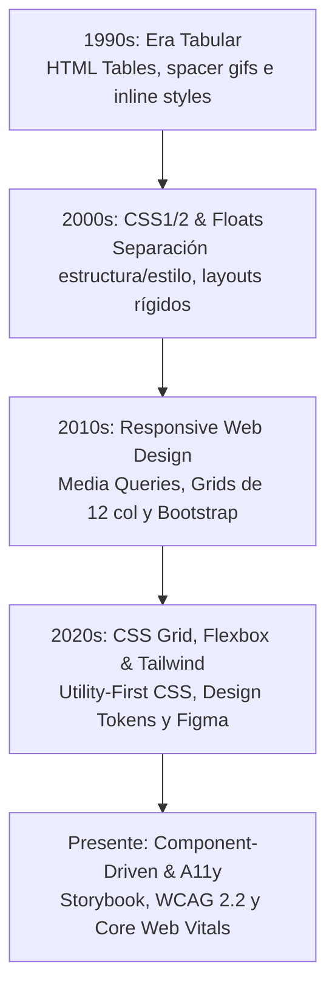
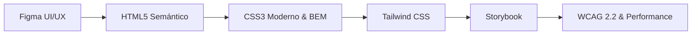

# 🎨 Diseño de Interfaces Web (DIW)

Bienvenido a la guía docente y cuerpo de apuntes del módulo **Diseño de Interfaces Web (DIW)**, correspondiente al 2.º curso del Ciclo Formativo de Grado Superior en **Desarrollo de Aplicaciones Web (DAW)**.

---

## 📜 1. Historia y Evolución del Diseño e Interfaz Web

Para entender cómo maquetamos y diseñamos en la actualidad, es imprescindible analizar cómo ha evolucionado la web en las últimas décadas:

1. **La Era Tabular y la Web Estática (Años 90):** La maquetación se realizaba mediante etiquetas `<table>`, bordes invisibles e imágenes transparentes para forzar espacios. El diseño era completamente rígido y enfocado a monitores CRT de **800 × 600 px**.
2. **La Revolución del CSS y el Diseño Fluid (Años 2000):** La llegada de CSS2 permitió separar la estructura (`HTML`) de la presentación (`CSS`). Se utilizaban *floats* y posicionamiento absoluto, lo que requería trucos complejos como el famoso *clearfix*.
3. **El Smartphone y la Era Responsive (Años 2010):** En 2010, Ethan Marcotte acuña el término *Responsive Web Design*. Surgen las *Media Queries* y frameworks monolíticos como **Bootstrap**, que democratizan el diseño basado en grillas de 12 columnas.
4. **La Era del Componente y la Maquetación Moderna (Presente):** El diseño se entiende como un **Sistema de Componentes Reutilizables**. Las herramientas de prototipado como **Figma** dominan el mercado de UI/UX, mientras que en código **Flexbox**, **CSS Grid** y **Tailwind CSS** reemplazan los viejos frameworks pesados.

---

## 🛠️ 2. Justificación de la Pila Tecnológica Seleccionada

En este curso se ha rechazado intencionadamente el aprendizaje de herramientas obsoletas o de baja demanda laboral. La selección tecnológica responde al estándar actual del perfil **Frontend Developer / UI Engineer**:

* **Figma (Diseño UI & Design Systems):** Es la herramienta estándar de la industria para diseño vectorial, prototipado colaborativo y creación de *Design Tokens*. Facilita el *handoff* (traspaso) impecable entre el equipo de diseño y el desarrollador.
* **HTML5 Semántico:** La base de la web moderna, la accesibilidad nativa y el posicionamiento SEO. Un HTML bien estructurado es el 50 % del trabajo de accesibilidad resuelto.
* **CSS3 Moderno (Flexbox, Grid, Custom Properties):** Antes de usar cualquier framework, es imprescindible dominar el *Box Model*, la especificidad, la cascada y los motores de layout nativos.
* **Tailwind CSS (Utility-First CSS):** Se ha consolidado como el motor CSS dominante en proyectos modernos (React, Next.js, Vue). Permite construir interfaces a gran velocidad sin salir del HTML/componente, manteniendo un sistema de diseño estricto y sin generar CSS redundante.
* **Storybook (Catálogo de Componentes):** Permite desarrollar, probar y documentar componentes UI de forma aislada (*Component-Driven Development*), replicando la forma real de trabajar en equipos profesionales.
* **WCAG 2.2 y Google Core Web Vitals:** La interfaz no solo debe ser atractiva, debe ser **accesible** para personas con diversidad funcional y **rápida** (optimización de fuentes, imágenes WebP/AVIF y rendimiento de renderizado).

---

## 🤝 3. Articulación con DWEC y Proyecto Transversal

Este módulo se imparte en estrecha coordinación con **Desarrollo Web en Entorno Cliente (DWEC)**. Ambos módulos alimentan un **Proyecto Transversal Único**:

> **Proyecto Web Integrador** = **DIW** (Interfaz, Diseño, CSS, Accesibilidad y Performance) + **DWEC** (Lógica, JavaScript/TypeScript, React y Estado)

---

## 📚 Estructura Detallada del Plan de Estudios

---

### 🟢 Bloque I: Diseño UI/UX, HTML Semántico, CSS Moderno y Assets (1.ª Evaluación)

* **UD 1: Diseño de Interfaces, Comunicación Visual y Figma Base (RA1)**
Principios de comunicación visual, jerarquía, teoría del color, escala tipográfica y primeros pasos con Figma (Frames y Grillas).
* **UD 2: Figma Avanzado, Design Systems y Design Tokens (RA1)**
Auto Layout moderno, Componentes, Variantes, Variables y diseño de un *Design System* completo exportable a código.
* **UD 3: HTML5 Semántico, Estructura Accesible y Formularios (RA2)**
Etiquetado semántico (`header`, `main`, `nav`, `article`), formularios modernos y estructura base para tecnologías asistivas.
* **UD 4: CSS3 Moderno, Layout (Flexbox/Grid), Container Queries y Responsive (RA2)**
Cascada, especificidad, modelo de caja, arquitecturas *Flexbox* y *CSS Grid*, unidades fluidas (`clamp()`) y *Container Queries*.
* **UD 5: Arquitectura CSS (BEM) y Utility-First con Tailwind CSS (RA2)**
Estrategias de organización CSS, metodología BEM y maquetación ágil mediante clases de utilidad con Tailwind CSS.
* **UD 6: Optimización Multimedia (WebP/AVIF), SVG e Introducción a Performance (RA3)**
Tratamiento digital de imagen, formatos de última generación, compresión, manipulación de SVG vectorial e imágenes responsive (`picture`, `srcset`).

---

### 🟡 Bloque II: Componentes UI, Dynamic UI, WCAG 2.2 y Audits (2.ª Evaluación)

| Unidad Didáctica | Subunidades y Bloques Temáticos | Competencias y Entregables Prácticos |
| --- | --- | --- |
| **UD 7: Componentes UI, Atomic Design y Storybook (RA4)** | • **7.1:** Arquitectura Atomic Design y Tokens   • **7.2:** Catálogo y Documentación con Storybook | • Diseñar una librería de componentes (átomos, moléculas, organismos).   • Publicar un catálogo interactivo de componentes aislado en Storybook. |
| **UD 8: Interactividad UI, DOM y Cross-Browser (RA4)** | • **8.1:** Eventos UI, Manipulación DOM y Validaciones   • **8.2:** Pruebas Responsive y DevTools Cross-Browser | • Componentes interactivos nativos (modales, acordeones, menús móviles).   • Auditoría de compatibilidad en múltiples navegadores (Chrome, Firefox, Safari). |
| **UD 9: Fundamentos de Accesibilidad Web y WCAG 2.2 (RA5)** | • **9.1:** Principios POUR, Niveles A/AA/AAA y WAI-ARIA   • **9.2:** Navegación por Teclado, Contraste y Lectores | • Implementación de roles ARIA y gestión del foco (`focus-visible`).   • Verificación de interfaces con lectores de pantalla (NVDA / VoiceOver). |
| **UD 10: Auditorías de Accesibilidad Profesional (RA5)** | • **10.1:** Herramientas Automáticas (Lighthouse, axe, WAVE)   • **10.2:** Evaluación Manual y Corrección de Errores | • Auditoría completa de un sitio web real con emisión de informe de fallos.   • Refactorización de código no accesible para alcanzar nivel AA. |
| **UD 11: Usabilidad, UX y Heurísticas de Nielsen (RA5/RA6)** | • **11.1:** Heurísticas de Nielsen y Rediseño (Antes/Después)   • **11.2:** Carga Cognitiva, Architecture Info y UX | • Evaluación heurística de una interfaz deficiente.   • Propuesta de rediseño en Figma e implementación maquetada. |
| **UD 12: Performance Web, Core Web Vitals y Proyecto Final (RA5)** | • **12.1:** Métricas de Rendimiento (LCP, INP, CLS)   • **12.2:** Proyecto Integrador: Auditoría Final de Interfaz | • Optimización de métricas Core Web Vitals con Google Lighthouse.   • Entrega y defensa del Proyecto Web Integrador de Aula. |

---

### 🔵 Bloque III: Formación en Empresa - FP Dual (3.er Trimestre - 18,18% CEs)

El tercer trimestre traslada el aprendizaje al entorno laboral real, cubriendo los criterios del **RA6 completo** y el bloque final del **RA5 (`5.f`, `5.g`)**:

* **E.1: Tests de Accesibilidad y Tecnologías Asistivas en Producción (`RA5.f`, `RA5.g`)**
Auditoría externa en aplicaciones en producción de la empresa utilizando herramientas profesionales de análisis y tecnología asistiva real.
* **E.2: Evaluación de Usabilidad y Rediseño de Interfaces Reales (`RA6.a`, `RA6.b`, `RA6.c`)**
Análisis de la usabilidad de sitios comerciales, adaptación a usuarios reales de la empresa y aplicación de estándares web.
* **E.3: Navegación por Periféricos, Pruebas Cross-Browser y Performance (`RA6.d`, `RA6.e`, `RA6.f`)**
Verificación de la usabilidad mediante múltiples periféricos, pruebas en diversidad de navegadores/dispositivos móviles y optimización final de rendimiento en entornos de producción.

---

